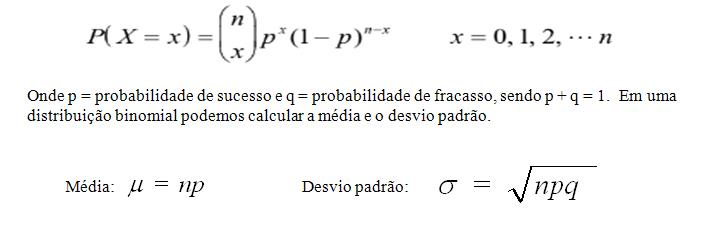

---
# Só mude aqui!!!!
author: "Luiz Gustavo dos Santos"
title: "Relatório 04"
bibliography: referencias.bib
# A partir daqui nao faca alteracoes!!!!!
link-citations: true
csl: associacao-brasileira-de-normas-tecnicas-ipea.csl
subtitle: "<a href='https://bendeivide.github.io/courses/epaec/' target='_blank'>Estatística e Probabilidade</a> </br> <a href='https://bendeivide.github.io' target='_blank'>Prof. Ben Dêivide (DEFIM/CAP/UFSJ)</a>"
include-before-body: header.html
date: today
lang: pt-BR
format:
  html:
    toc: true
    number-sections: true
    theme: bootstrap
    #css: styles.css
    code-fold: true
    code-tools: true
execute:
  echo: true
  warning: false
  message: false
---


##  Introdução

As distribuições de probabilidade constituem um dos pilares fundamentais da estatística e da teoria das probabilidades, fornecendo a base matemática para a modelagem e análise de fenômenos aleatórios. Por meio delas, é possível descrever o comportamento de variáveis aleatórias, quantificar incertezas e extrair inferências confiáveis a partir de dados observados.


O estudo das distribuições de probabilidade apresenta relevância em diversas áreas do conhecimento, desde as ciências exatas e naturais até as ciências humanas e sociais. Na engenharia, na medicina, na economia e nas ciências computacionais, a modelagem probabilística permite compreender padrões, prever comportamentos e embasar decisões em contextos de incerteza.


##  Objetivos

### Objetivo geral

Este relatório tem como objetivo apresentar os principais tipos de distribuições de probabilidade, discutindo suas características, propriedades e aplicações práticas. Serão abordadas tanto as **distribuições discretas** como a binomial e a de Poisson, quanto as **distribuições contínuas** com destaque para a distribuição normal, além dos conceitos fundamentais que as sustentam, como a função de densidade de probabilidade e a função de distribuição acumulada.


### Objetivos específicos

Demonstrar 3 tipos de distribuições de probabilidade, seu cálculo e suas aplicações no dia-a-dia da engenharia.

---


## Classificação das variáveis aleatórias

Antes de detalhar cada distribuição, é crucial entender a natureza da variável aleatória ($X$) envolvida:
  
  **A) Variáveis Aleatórias Discretas:** São aquelas cujos resultados podem ser contados (valores inteiros, geralmente). Você não tem "meio" sucesso ou "3,5" e-mails recebidos.
  
  
  **Distribuições:** Binomial e Poisson.
  
  
  **B) Variáveis Aleatórias Contínuas:** São aquelas que podem assumir qualquer valor dentro de um intervalo (números decimais, medidas). Elas dependem da precisão do instrumento de medida (peso, altura, tempo).
  
  
  **Distribuição:** Normal.


## Distribuições de probabilidade 

As distribuições de probabilidade descrevem como os valores de uma variável aleatória se distribuem, ou seja, qual a chance de cada resultado ocorrer.
Existem dois grandes tipos. As **distribuições discretas** lidam com variáveis que assumem valores contáveis — como o número de caras em lançamentos de moeda. As **distribuições contínuas** descrevem variáveis que podem assumir qualquer valor em um intervalo, como altura ou temperatura.


### Tipos de distribuição de probabilidades


#### Distribuição normal (Gaussiana)


Embora muitos associem a curva a Gauss, quem primeiro a "esboçou" foi Abraham de Moivre em 1733. Ele estava tentando resolver um problema prático: calcular probabilidades em jogos de azar que envolviam muitos lançamentos de moedas.

Em 1810, Laplace retomou o trabalho de Moivre e foi além. Ele demonstrou o Teorema Central do Limite, uma das colunas da estatística. Laplace provou que, quando somamos muitas variáveis aleatórias independentes, o resultado final tende a seguir uma Distribuição Normal, independentemente da forma original dessas variáveis.

Carl Friedrich Gauss, um dos maiores matemáticos da história, em 1809, aplicou essa curva para resolver problemas de Astronomia.

Ele percebeu que os erros de medição dos astrônomos ao observar corpos celestes seguiam esse padrão: 
  
  Erros pequenos eram muito frequentes, e erros grandes eram raros. Ele derivou a fórmula matemática da curva como a conhecemos hoje para descrever a "Teoria dos Erros". É por isso que a chamamos de **"Distribuição Gaussiana".** 


O termo "Normal" veio mais tarde, no século XIX. Adolphe Quetelet aplicou a estatística à sociologia, percebendo que características humanas (como altura e peso) seguiam o sino de Gauss. Sir Francis Galton popularizou o termo "Normal" porque a curva parecia descrever o "estado normal" das coisas na natureza.

***Definição***

Distribuição Normal — a famosa **"curva em sino"**. Simétrica em torno da média, descreve fenômenos naturais como altura, peso e erros de medição. É central na estatística por causa do Teorema do Limite Central. A distribuição Normal é atribuída as variáveis aleatórias contínuas.


**Como calcular?**

**A) A distribuição normal é definida pela sua função de densidade de probabilidade (PDF):**

$$f(x) = \frac{1}{\sigma\sqrt{2\pi}} e^{-\frac{1}{2}\left(\frac{x-\mu}{\sigma}\right)^2}$$

onde μ\mu    é a média e σ\sigma
é o desvio padrão.

**B) Probabilidade como área sob a curva:**


A probabilidade de X deve estar em um intervalo
[a,b] é a integral da PDF:

$$P(a \leq X \leq b) = \int_{a}^{b} \frac{1}{\sigma\sqrt{2\pi}} e^{-\frac{1}{2}\left(\frac{x-\mu}{\sigma}\right)^2} dx$$
O problema analítico central é que essa integral não tem solução em forma fechada — não existe uma antiderivada elementar para $e^{-x^2}$. Por isso, na prática, ela é resolvida por dois caminhos.


**Caminho 1: Padronização (variável Z):**
Qualquer distribuição normal $X \sim \mathcal{N}(\mu, \sigma^2)$ pode ser transformada na distribuição normal padrão $X \sim \mathcal{N}(0,1)$ pela substituição: $$Z = \frac{X - \mu}{\sigma}$$


A Função densidade de probabilidade **(PDF)** simplifica para:
$$\phi(z) = \frac{1}{\sqrt{2\pi}} e^{-z^2 / 2}$$
E a função de distribuição acumulada **(FDA)** torna-se:
$$  \Phi(z) = \int_{-\infty}^{z} \phi(t) \, dt$$

**Caminho 2: A função Erro(ERF):**

A única forma de expressar $Φ(z)$ analiticamente é por meio da função erro, definida como:

$$\text{erf}(x) = \frac{2}{\sqrt{\pi}} \int_{0}^{x} e^{-t^2} \, dt$$


A relação com a **FDA** normal é:


$$\Phi(z) = \frac{1}{2} \left[ 1 + \text{erf}\left( \frac{z}{\sqrt{2}} \right) \right]$$

**Na prática**


Para calcular $P(a≤X≤b)$ analiticamente, usa-se:

$$P(a \leq X \leq b) = \Phi \left( \frac{b - \mu}{\sigma} \right) - \Phi \left( \frac{a - \mu}{\sigma} \right)$$

Antes dos computadores, os valores de $Φ(z)$ eram consultados em tabelas Z pré-calculadas numericamente.Hoje são calculados diretamente por algoritmos.Veja a seguir uma imagem da tabela da normal padrão com os valores da **função de distribuição acumulada $Φ(z)$**:  


Em resumo: **a distribuição normal** é definida de forma exata e fechada pela sua **Função densidade de probabilidade(PDF)**, mas o cálculo de probabilidades exige integração numérica ou a função erro — não existe uma fórmula simples de antiderivada. Isso a torna analiticamente elegante, mas computacionalmente dependente de aproximações.

##### **Exemplo de aplicação**

 Suponha que a altura de adultos siga $X∼N(μ=170,σ=10)$.Pede-se a probabilidade dos adultos terem a altura entre 1,60m e 1,85m. Queremos calcular:
  $$P(160≤X≤185)$$
  **Passo 1 — Padronizar os limites:**
  
  
  $z_1 = \frac{160 - 170}{10} = -1,0$ $z_2 = \frac{185 - 170}{10} = 1,5$

 **Passo 2 — Consultar os valores da FDA($Φ(z)$) na tabela: **
 
 
 Os valores da função de distribuição acumulada ($Φ(z)$) ou probabilidade de "z" estão apresentados na tabela de probabilidades da frequência normal.
 
 
 $Φ(−1,0)=0,1587$
 $Φ(1,5)=0,9332$

 
 **Passo 3 — Subtrair as probabilidades $Φ(z2)$ - $Φ(z1)$  :**
 
$$ P(160≤X≤185)=0,9332−0,1587=0,7745$$
 Ou seja, aproximadamente 77,5% das pessoas têm entre 160 cm e 185 cm.
 
 
**Como fazer utilizando o Rstudio??**

```{r}
# ============================================================
#  Distribuição Normal — Cálculo e Visualização
#  Exemplo: X ~ N(μ = 170, σ = 10)
#  Objetivo: P(160 ≤ X ≤ 185)
# ============================================================

# --- Parâmetros (altere aqui) --------------------------------
mu    <- 170   # média
sigma <- 10    # desvio padrão
a     <- 160   # limite inferior
b     <- 185   # limite superior
# ------------------------------------------------------------


# ============================================================
# 1. CÁLCULO ANALÍTICO
# ============================================================

z1 <- (a - mu) / sigma
z2 <- (b - mu) / sigma

phi_z1 <- pnorm(z1)   # Φ(z1)
phi_z2 <- pnorm(z2)   # Φ(z2)

prob <- phi_z2 - phi_z1

cat("======================================\n")
cat("  Distribuição Normal: N(μ =", mu, ", σ =", sigma, ")\n")
cat("======================================\n")
cat(sprintf("  Intervalo : [%.1f, %.1f]\n", a, b))
cat(sprintf("  z₁ = (%.1f - %.1f) / %.1f = %.4f\n", a, mu, sigma, z1))
cat(sprintf("  z₂ = (%.1f - %.1f) / %.1f = %.4f\n", b, mu, sigma, z2))
cat(sprintf("  Φ(z₁) = %.4f\n", phi_z1))
cat(sprintf("  Φ(z₂) = %.4f\n", phi_z2))
cat("--------------------------------------\n")
cat(sprintf("  P(%.1f ≤ X ≤ %.1f) = %.4f  (%.2f%%)\n", a, b, prob, prob * 100))
cat("======================================\n\n")


# ============================================================
# 2. APROXIMAÇÃO NUMÉRICA — Regra de Simpson
# ============================================================

simpson <- function(f, lower, upper, n = 100) {
  if (n %% 2 != 0) n <- n + 1          # n deve ser par
  h  <- (upper - lower) / n
  xi <- seq(lower, upper, by = h)
  yi <- f(xi)
  coef <- c(1, rep(c(4, 2), (n - 2) / 2), 4, 1)
  (h / 3) * sum(coef * yi)
}

pdf_normal <- function(x) dnorm(x, mean = mu, sd = sigma)

prob_simpson <- simpson(pdf_normal, a, b, n = 100)

cat("--------------------------------------\n")
cat("  Aproximação via Regra de Simpson\n")
cat(sprintf("  P(%.1f ≤ X ≤ %.1f) ≈ %.4f  (%.2f%%)\n",
            a, b, prob_simpson, prob_simpson * 100))
cat(sprintf("  Erro absoluto: %.2e\n", abs(prob - prob_simpson)))
cat("--------------------------------------\n\n")


# ============================================================
# 3. GRÁFICO
# ============================================================

x_seq <- seq(mu - 4 * sigma, mu + 4 * sigma, length.out = 500)
y_seq <- dnorm(x_seq, mean = mu, sd = sigma)

# Região sombreada
x_shade <- seq(a, b, length.out = 300)
y_shade <- dnorm(x_shade, mean = mu, sd = sigma)

# Cores
col_curve  <- "#534AB7"
col_fill   <- "#AFA9EC"
col_lines  <- "#D85A30"
col_text   <- "#3C3489"

# Plot base
plot(x_seq, y_seq,
     type = "l", lwd = 2.5, col = col_curve,
     xlab = "x", ylab = "f(x)",
     main = bquote(bold("Distribuição Normal") ~
                     "  " ~ mu == .(mu) ~ ", " ~ sigma == .(sigma)),
     las = 1, bty = "l",
     panel.first = grid(col = "gray92", lty = 1))

# Área sombreada
polygon(c(a, x_shade, b),
        c(0, y_shade, 0),
        col  = adjustcolor(col_fill, alpha.f = 0.5),
        border = NA)

# Linhas dos limites
abline(v = c(a, b), lty = 2, col = col_lines, lwd = 1.5)

# Anotações z
mtext(sprintf("z₁ = %.2f", z1), side = 1, at = a,
      line = 2, cex = 0.8, col = col_lines)
mtext(sprintf("z₂ = %.2f", z2), side = 1, at = b,
      line = 2, cex = 0.8, col = col_lines)

# Probabilidade na área
x_mid <- (a + b) / 2
y_mid <- dnorm(x_mid, mean = mu, sd = sigma) * 0.55
text(x_mid, y_mid,
     labels = sprintf("P = %.2f%%", prob * 100),
     col = col_text, cex = 1.1, font = 2)

# Curva por cima da sombra
lines(x_seq, y_seq, lwd = 2.5, col = col_curve)


```


#### Distribuição Binomial

A história da Binomial está eternizada na obra póstuma de Bernoulli, intitulada Ars Conjectandi (A Arte de Conjeturar), publicada em 1713.Bernoulli queria entender como prever a probabilidade de resultados em eventos repetitivos que tivessem apenas duas saídas (como ganhar ou perder, cara ou coroa). Antes dele, matemáticos como Pascal e Fermat já estudavam jogos de azar, mas Bernoulli foi quem formalizou o processo matemático para $n$ tentativas independentes.


Bernoulli definiu o que hoje chamamos de Ensaios de Bernoulli: um experimento onde a probabilidade de sucesso ($p$) é constante e cada tentativa é independente da anterior.
A grande sacada de Jacob foi perceber que, para calcular o sucesso em várias tentativas, ele precisava combinar a álgebra das potências com a análise combinatória (o famoso Triângulo de Pascal).

A Distribuição Binomial foi a base para Jacob Bernoulli provar o seu "Teorema Dourado", hoje conhecido como a Lei Fraca dos Grandes Números.Ele provou matematicamente que, quanto mais vezes você repete um experimento binomial, mais a frequência observada dos sucessos se aproxima da probabilidade real    ($p$).Isso deu legitimidade científica à estatística: agora era possível estimar probabilidades desconhecidas através da observação repetida.

***Definição***

Distribuição Binomial — modela o número de sucessos em n tentativas independentes, cada uma com probabilidade p de sucesso. No fundo ela responde a uma pergunta bem simples da vida real:

"Se eu tentar algo várias vezes, quantas vezes vou conseguir?"

A matemática usa o conceito de combinações para contar de quantas formas os sucessos podem se arranjar dentro das tentativas, multiplicando pela probabilidade de cada arranjo acontecer. É uma conta que parece difícil, mas que no fundo só está somando possibilidades. A distribuição binomial é uma ferramenta para quantificar a incerteza em situações repetitivas, transformando intuição em probabilidade concreta. Simples na essência, poderosa na prática. É atribuída as variáveis aleatórias discretas.


A fórmula para calcular é: 

$$P(X = k) = \binom{n}{k} \cdot p^k \cdot (1 - p)^{n - k}$$

onde:


$n = número$ $total$ $de$ $tentativas$ 

$k = número$ $de$ $sucessos$ $desejados$ $(0 ≤ k ≤ n)$

$p = probabilidade$ $de$ $sucesso$ $em$ $cada$ $tentativa$ 

$(1 − p) = probabilidade$ $de$ $fracasso$

$( n / k ) = combinação de ((n k) a k) = n! / [ k! · (n−k)! ]$


**Na prática**

**Passo 1 — Verifique as 4 condições**

 
 Antes de qualquer cálculo, confirme que o seu problema satisfaz todas as condições da distribuição binomial:


 **A)** Número fixo de tentativas — você sabe quantas vezes o experimento se repete (n).
 
 
 **B)** Apenas dois resultados — cada tentativa termina em sucesso ou fracasso.
     


 **C)** Probabilidade constante — a chance de sucesso (p) é a mesma em todas as tentativas.
     
 
 
 **D)** Tentativas independentes — o resultado de uma não influencia as demais.


**Passo 2 — Identifique n, k e p**


**A)** n = número total de tentativas


**B)** k = número de sucessos que você quer calcular a probabilidade


**C)** p = probabilidade de sucesso em cada tentativa (entre 0 e 1)


**Passo 3 — Calcule o coeficiente binomial C(n, k)**

O coeficiente binomial conta de quantas formas os k sucessos podem se distribuir entre as n tentativas:

$$C(n, k) = n! / [ k! × (n − k)! ]$$


**Passo 4 — Calcule as probabilidades $p^k$ e $(1−p)^(n−k)$**


Agora calcule a chance de obter exatamente k sucessos e (n−k) fracassos em uma sequência específica:


$$1) p^k$$      
$$2) (1−p)^(n−k)$$


**Passo 5 — Multiplique tudo e obtenha P(X = k)**


Junte os três componentes na fórmula final:


$$P(X = k) = C(n,k) × p^k × (1−p)^(n−k)$$


***Exemplo de Aplicação***


Uma prova de múltipla escolha tem 8 questões, cada uma com 4 alternativas (apenas uma correta). Um aluno chuta todas as respostas. Qual a probabilidade de ele acertar exatamente 3 questões?


**Passo 1) Verificando as 4 condições:**
 

A) Número fixo de tentativas: 8 questões
 
B) Dois resultados: acertar ou errar

C) Probabilidade constante: 0,25 em cada questão

D) Independência: chutar uma não afeta as outras


**Passo 2) Identificando os parâmetros**


 **n**-(Número de questões) = $8$

 **p**-(1 alternativa correta em 4)=  $1/4 = 0,25$

 **k**-(Queremos 3 acertos)= $3$

 **(1-p)**-(Probabilidade de erro da questão )= $0,75$


**Passo 3) Aplicando a fórmula:** $$P(X = k) = \binom{n}{k} \cdot p^k \cdot (1 - p)^{n - k}$$

Substituindo $X∼B(8, 0,25)$:


$$P(X = 3) = \binom{8}{3} (0,25)^3 (0,75)^5$$


**Passo 3A) Calculando a combinação de "n" e "k":**

$$C_{n,k} = \binom{n}{k} = \frac{n!}{k!(n-k)!}$$


Temos:

$$\binom{8}{3} = \frac{8!}{3! \cdot 5!} = 56$$
**Passo 3B) Probabilidades:**


  $(0,25)^3=0,015625$
  
  
  
  
  $(0,75)^5=0,2373$
  
  
  
**Passo 3C) Multiplicando:**
  
  
$$P(X=3)=56×0,015625×0,2373≈0,2076​$$

**Interpretação:**  O aluno chutando todas as respostas tem aproximadamente 20,76% de chance de acertar exatamente 3 questões.

**Média e desvio padrão:**
 
 
 $$μ=n⋅p=8×0,25=2$$
 $$\sigma = \sqrt{8 \times 0,25 \times 0,75} = \sqrt{1,5} \approx 1,22$$
  
  Ou seja, chutando, o aluno acerta em média 2 questões, com desvio padrão de ±1,22.


***Como fazer utilizando o Rstudio?***

```{r}
# ============================================
# Distribuição Binomial — Prova de Múltipla Escolha
# ============================================

# Parâmetros
n <- 8        # número de questões
p <- 0.25     # probabilidade de acertar (1 em 4 alternativas)
k <- 3        # número de acertos desejados

# ============================================
# 1. P(X = 3) — probabilidade exata
# ============================================
prob_exata <- dbinom(k, size = n, prob = p)
cat("P(X = 3) =", round(prob_exata, 4), "\n")

# ============================================
# 2. Média e Desvio Padrão
# ============================================
media <- n * p
variancia <- n * p * (1 - p)
desvio_padrao <- sqrt(variancia)

cat("Média (μ):", media, "\n")
cat("Variância (σ²):", variancia, "\n")
cat("Desvio Padrão (σ):", round(desvio_padrao, 4), "\n")

# ============================================
# 3. Tabela de probabilidades (X = 0 até 8)
# ============================================
tabela <- data.frame(
  k = 0:n,
  Probabilidade = round(dbinom(0:n, size = n, prob = p), 4)
)
print(tabela)

# ============================================
# 4. Gráfico da distribuição
# ============================================
barplot(
  dbinom(0:n, size = n, prob = p),
  names.arg = 0:n,
  col = ifelse(0:n == k, "tomato", "steelblue"),
  main = "Distribuição Binomial B(8, 0.25)",
  xlab = "Número de acertos (k)",
  ylab = "P(X = k)",
  ylim = c(0, 0.35)
)
abline(h = 0)
legend("topright",
       legend = c("k = 3 (desejado)", "outros valores"),
       fill = c("tomato", "steelblue"))
```


***Aplicações da distribuição Binomial***


**1. Controle de Qualidade (Indústria)**


Esta é talvez a aplicação mais comum. As empresas utilizam a binomial para prever a taxa de defeitos em um lote de produção.

Exemplo: Se uma fábrica sabe que 2% das lâmpadas produzidas são defeituosas, a distribuição binomial ajuda a calcular a probabilidade de encontrar exatamente 5 lâmpadas ruins em uma caixa com 100.


**2. Marketing e Vendas**


Utilizada para medir a eficácia de campanhas e taxas de conversão.

Teste A/B: Se você envia 1.000 e-mails marketing, qual a chance de pelo menos 50 pessoas clicarem no link, dado que a taxa histórica de cliques é de 4%?

Pesquisas de Opinião: Determinar a probabilidade de um número específico de eleitores apoiar um candidato em uma amostra aleatória.


**3. Medicina e Saúde**


Fundamental em testes clínicos e estudos epidemiológicos.

Eficácia de Medicamentos: Se um remédio tem 80% de taxa de cura, qual a probabilidade de ele curar 8 de 10 pacientes em um grupo de teste?

Genética: Calcular a probabilidade de um descendente herdar um gene específico (ex: 25% de chance de olhos azuis).


**4. Finanças e Seguros**


Ajuda na modelagem de riscos e inadimplência.

Risco de Crédito: Qual a probabilidade de que 3 entre 50 tomadores de empréstimo atrasem o pagamento?

Investimentos: Modelar a movimentação de preços de ativos em modelos simplificados (como o Modelo Binomial de Precificação de Opções).


**5. Esportes**


Para prever desempenhos baseados em médias históricas.

Exemplo: Se um batedor de pênaltis tem 90% de aproveitamento, qual a chance de ele acertar todos os próximos 5 chutes?


**Fórmula da distribuição Binomial**




#### Distribuição de Poisson

A distribuição de Poisson foi introduzida em 1837 pelo matemático francês Siméon Denis Poisson (1781–1840) em sua obra "Pesquisa sobre a probabilidade de julgamentos em matéria criminal e civil". Ela surgiu como uma forma de modelar a probabilidade de eventos raros ocorrerem em um intervalo fixo de tempo ou espaço, inicialmente aplicada a jogos de azar e condenações judiciais. É uma distribuição aplicada as variáveis aleatórias discretas.


***Definição***


Distribuição de Poisson — conta eventos raros em um intervalo de tempo ou espaço fixo. Útil para modelar chegadas de clientes, falhas de equipamento, etc.

**A ideia central** — Imagine que você trabalha numa padaria e percebe que, em média, 4 clientes entram por hora. Você não sabe exatamente quando cada um vai chegar — pode vir 2 numa hora, pode vir 7 em outra. Mas ao longo do tempo, a média se mantém estável.


A distribuição de Poisson responde à pergunta:

"Se sei quantas vezes algo acontece em média, qual a chance de acontecer exatamente k vezes num intervalo?"

A distribuição de Poisson está em todo lugar onde eventos acontecem de forma aleatória, mas com frequência média conhecida.

***Aplicações da distribuição de Poisson***

  **Hospitais:** Chegada de pacientes em determinado intervalo de tempo.
  
  
  **Meteorologia:** Ligações recebidas em um determinado intervalo de tempo.
  

  **Trânsito:** Acidentes em uma rodovia num determinado intervalo de tempo.
  

***Como calcular?***  

**Fórmula**

$$P(X = k) = \frac{e^{-\lambda} \cdot \lambda^k}{k!}$$

Onde:

$λ (lambda) →$ média de eventos no intervalo

$k →$ número de eventos que queremos calcular

$e →$ número de Euler $≈ 2,718$


***Exemplo de aplicação***

Um pronto-socorro recebe em média 5 pacientes por hora. Qual a probabilidade de chegarem exatamente 8 pacientes numa determinada hora?


**Passo 1) Identificando os parâmetros:**


$λ$(média de pacientes por hora) = $5$


$k$(queremos exatamente 8 chegadas) = $8$


$e$(constante de Euler) = $2,718$


**Passo 2)Verificando as condições:**


 Eventos aleatórios: chegadas imprevisíveis


 
 
 Média estável: λ = 5 pacientes/hora
 
 
 
 
 Independência: a chegada de um não afeta o outro


**Passo 3) Aplicando a fórmula:**


$$P(X = k) = \frac{e^{-\lambda} \cdot \lambda^k}{k!}$$


Temos:


$$P(X = 8) = \frac{0,006738 \times 390.625}{40.320} \approx \boxed{0,0653}$$


***Interpretação:*** Há aproximadamente ***6,53%*** de chance de chegarem exatamente 8 pacientes em 1 hora.


**Média e Desvio Padrão**


$$μ=λ=5 pacientes$$


$$σ=λ=5≈2,24\sigma = \sqrt{\lambda} = \sqrt{5} \approx 2{,}24σ=λ​=5​≈2,24$$


***Como resolver no Rstudio?***
```{r}
# ============================================
# Distribuição de Poisson — Pronto-Socorro
# ============================================

# Parâmetros
lambda <- 5     # média de pacientes por hora
k <- 8          # número de chegadas desejado

# ============================================
# 1. P(X = 8) — probabilidade exata
# ============================================
prob_exata <- dpois(k, lambda = lambda)
cat("P(X = 8) =", round(prob_exata, 4), "\n")

# ============================================
# 2. Média e Desvio Padrão
# ============================================
media <- lambda
desvio_padrao <- sqrt(lambda)

cat("Média (μ):", media, "\n")
cat("Desvio Padrão (σ):", round(desvio_padrao, 4), "\n")

# ============================================
# 3. Tabela de probabilidades (X = 0 até 15)
# ============================================
tabela <- data.frame(
  k = 0:15,
  Probabilidade = round(dpois(0:15, lambda = lambda), 4)
)
print(tabela)

# ============================================
# 4. Gráfico da distribuição
# ============================================
barplot(
  dpois(0:15, lambda = lambda),
  names.arg = 0:15,
  col = ifelse(0:15 == k, "tomato", "steelblue"),
  main = "Distribuição de Poisson (λ = 5)",
  xlab = "Número de pacientes (k)",
  ylab = "P(X = k)",
  ylim = c(0, 0.20)
)
abline(h = 0)
legend("topright",
       legend = c("k = 8 (desejado)", "outros valores"),
       fill = c("tomato", "steelblue"))


```

---

##  Metodologia

Neste relatório, foi utilizado o software Rstudio, as ferramentas de documentação Rmarkdown e Latex, além do material de pesquisa.

---

## Aprofundamento

Nesta seção trarei um exemplo de cada distribuição aplicado na área de engenharia civil, curso que estou em formação. Todos os cálculos e códigos dos exemplos serão expressados nesta seção.

### Distribuição normal (Gaussiana)

Na Engenharia Civil, a Distribuição Normal é a ferramenta fundamental para lidar com a incerteza dos materiais. O exemplo mais clássico e vital é o cálculo da resistência à compressão do concreto (fck).

***1) Resistência do concreto(fck):***

Imagine que você é o engenheiro responsável por uma obra. Você encomendou um concreto de 30 MPa. O laboratório testou vários corpos de prova e te enviou os seguintes dados estatísticos:


Média da resistência observada ($f_m$): $35\text{ MPa}$


Desvio Padrão ($\sigma$): $3\text{ MPa}$


Qual é o valor do $f_{ck}$ dessa obra? (Ou seja, qual a resistência que você pode realmente garantir que 95% das amostras superam)?


**Passo 1) Aplicação da fórmula:**


A fórmula da estatística aplicada, baseada na Distribuição Normal, é:


$$f_{ck} = f_m - 1,645 \cdot \sigma$$


**Obs:** O valor $1,645$ vem da Tabela Normal Padrão ($Z$) . Ele representa o ponto na curva onde exatamente 5% da área está à esquerda (a zona de risco que queremos minimizar).


Passo a passo do cálculo:

**Passo 2) Identificar os valores:**


$f_m = 35$


$\sigma = 3$


**Passo 3) Substituir na fórmula:**


$$f_{ck} = 35 - (1,645 \cdot 3)$$


$$f_{ck} = 35 - 4,935$$


**Passo 4) Resultado final:**


$$f_{ck} \approx 30,06\text{ MPa}$$


**Interpretação do Engenheiro**


Neste exemplo, o seu $f_{ck}$ calculado foi de 30,06 MPa. Como o projeto pedia 30 MPa, sua obra está aprovada e segura.Isso significa que, embora a média seja 35, você "desconta" uma margem de segurança devido à variabilidade do material (o desvio padrão) para garantir que o risco de falha seja baixíssimo (apenas 5%).


***Como fazer utilizando o Rstudio:***


```{r}
# --- Exemplo de Cálculo de fck na Engenharia Civil ---

# 1. Definir os dados coletados no laboratório
media_resistencia <- 35   # fm (média em MPa)
desvio_padrao <- 3        # sigma (variabilidade)
confianca_nivel <- 0.05   # admitimos 5% de amostras abaixo do fck

# 2. Encontrar o valor de Z para 5% (Distribuição Normal)
# A função qnorm() retorna o valor da abscissa para uma probabilidade acumulada
z_valor <- qnorm(confianca_nivel, lower.tail = TRUE) 
# Nota: qnorm(0.05) resultará em aproximadamente -1.644854

# 3. Aplicar a fórmula do fck
# fck = média + (Z * desvio_padrao) 
# (Como Z é negativo, ele subtrairá da média)
fck <- media_resistencia + (z_valor * desvio_padrao)

# 4. Exibir o resultado formatado
cat("--- RESULTADOS ---\n")
cat("Média da Resistência:", media_resistencia, "MPa\n")
cat("Desvio Padrão:", desvio_padrao, "MPa\n")
cat("Valor de Z (5%):", round(z_valor, 3), "\n")
cat("Resistência Característica (fck):", round(fck, 2), "MPa\n")

# --- BÔNUS: Visualização Gráfica ---

# Criar uma sequência de valores para o eixo X (resistências)
x <- seq(20, 50, length=100)
y <- dnorm(x, mean=media_resistencia, sd=desvio_padrao) # Densidade da Normal

# Desenhar a curva
plot(x, y, type="l", lwd=2, col="blue", 
     main="Distribuição da Resistência do Concreto",
     xlab="Resistência (MPa)", ylab="Densidade")

# Pintar a área de risco (os 5% abaixo do fck)
x_risco <- seq(20, fck, length=50)
y_risco <- dnorm(x_risco, mean=media_resistencia, sd=desvio_padrao)
polygon(c(20, x_risco, fck), c(0, y_risco, 0), col="red", border=NA)

# Adicionar linha do fck
abline(v = fck, col="darkred", lty=2, lwd=2)
text(fck-2, 0.02, paste("fck =", round(fck, 1)), col="darkred")


```


### Distribuição Binomial 


Na Engenharia Civil, a Distribuição Binomial é amplamente utilizada na Gestão de Riscos e na Segurança Estrutural, especificamente para calcular a probabilidade de um evento extremo (como uma inundação, um terremoto ou a falha de um componente) ocorrer dentro de um determinado período de tempo (vida útil da obra).

O exemplo mais prático é o cálculo do Risco de Excesso em obras de drenagem ou barragens.

***1)Período de Retorno e Vida Útil***


Imagine que você projetou um sistema de drenagem para uma rodovia dimensionado para uma chuva com Período de Retorno ($T$) de 20 anos. Isso significa que, em qualquer ano específico, a probabilidade dessa chuva ocorrer é $p = \frac{1}{T} = \frac{1}{20} = 0,05$ (ou 5%).


O cliente quer saber: "Qual a probabilidade dessa drenagem falhar (ser inundada) pelo menos uma vez durante os 10 anos de concessão da rodovia?"


**Passo 1)  Definição das Variáveis Aleatórias:**


Variável Discreta ($X$): O número de vezes que a chuva de projeto ocorre (sucessos).


Tentativas ($n$): 10 anos (o período de tempo analisado).


Probabilidade de Sucesso ($p$): 0,05 (probabilidade da chuva ocorrer em um ano).


Probabilidade de Fracasso ($q$): 0,95 (probabilidade da chuva NÃO ocorrer em um ano).


**Passo 2) Calculo do risco de inundação:**

Para saber a chance de falhar pelo menos uma vez, é mais fácil calcular a chance de nunca falhar ($X = 0$) e subtrair de 100%. A fórmula da distribuição Binomial é:


$$P(X = k) = \binom{n}{k} \cdot p^k \cdot (1 - p)^{n - k}$$


Substituindo as variáveis na fórmula:


$$P(X=0) = \binom{10}{0} \cdot (0,05)^0 \cdot (0,95)^{10}$$


$$P(X=0) = 0,95^{10} \approx 0,5987 $$


O Risco de Falha (pelo menos uma vez) será:


$$Risco = 1 - P(X=0) = 1 - 0,5987 = 0,4013 $$

O risco de ocorrer 1 inundação ao longo dos  10 anos será de aproximadamente ***40,13%***


***Como fazer utilizando o Rstudio:***

```{r}
# --- Exemplo Binomial: Risco de Inundação na Engenharia ---

n_anos <- 10        # Período de vida útil/concessão
periodo_retorno <- 20
p_sucesso <- 1 / periodo_retorno # Probabilidade anual (p)

# 1. Probabilidade de NUNCA ocorrer a chuva em 10 anos P(X=0)
prob_zero_falhas <- dbinom(0, size = n_anos, prob = p_sucesso)

# 2. Risco de ocorrer PELO MENOS UMA VEZ
risco_total <- 1 - prob_zero_falhas

cat("Risco de falha em", n_anos, "anos:", round(risco_total * 100, 2), "%\n")

# --- Visualização: Probabilidade de 'k' ocorrências ---
sucessos <- 0:4
probabilidades <- dbinom(sucessos, size = n_anos, prob = p_sucesso)

barplot(probabilidades, names.arg = sucessos, col = "steelblue",
        main = "Probabilidade de Ocorrências da Chuva",
        xlab = "Número de vezes que a chuva ocorre em 10 anos",
        ylab = "Probabilidade")
```

***Interpretação do engenheiro***

Este exemplo mostra que, embora a chuva de "1 em 10 anos" pareça rara para um ano isolado, a chance dela causar um problema ao longo de 10 anos é de mais de 40%.Se o engenheiro considerar esse risco muito alto, ele terá que:


**1)** Aumentar o Período de Retorno no projeto (ex: usar uma chuva de 1 em 50 anos).

**2)** Isso diminuirá o $p$, reduzindo consequentemente o risco calculado pela Distribuição Binomial.


### Distribuição de Poisson


Na Engenharia Civil, a Distribuição de Poisson é a ferramenta padrão para modelar o fluxo e a segurança em infraestruturas onde eventos ocorrem de forma aleatória e independente ao longo do tempo.


Um dos exemplos mais claros e práticos da Distribuição de Poisson na Engenharia Civil é o gerenciamento de Segurança do Trabalho em Canteiros de Obras.

Diferente da Binomial (onde você tem um número fixo de tentativas), em um canteiro de obras os acidentes são eventos raros que podem ocorrer a qualquer momento em um "contínuo" de tempo.


**1) Ocorrência de Acidentes de Trabalho**

Imagine que você é o engenheiro responsável pela segurança de uma grande construtora. Ao analisar os dados históricos dos últimos 5 anos, você observa que ocorre, em média, 2 acidentes leves por mês em todos os canteiros da empresa.

Variável Aleatória ($X$): Número de acidentes por mês.


Taxa Média ($\lambda$): 2 acidentes/mês.


**Passo 1) Interpretando o problema:**


Você precisa apresentar um plano de contingência para a diretoria. Para isso, precisa calcular: Qual a probabilidade de um mês ser "fora da curva" e registrar exatamente 4 acidentes?

**Passo 2) Aplicando a fórmula:**

A fórmula da distribuição de Poisson é:


$$P(X = k) = \frac{e^{-\lambda} \cdot \lambda^k}{k!}$$


Substituindo os valores para $k = 4$ e $\lambda = 2$:


$$P(X = 4) = \frac{e^{-2} \cdot 2^4}{4!}$$

Calculando temos: 


$e^{-2} \approx 0,1353$


$2^4 = 16$


$4! = 4 \times 3 \times 2 \times 1 = 24$


$$P(X = 4) = \frac{0,1353 \cdot 16}{24} = \frac{2,1648}{24} \approx 0,0902$$

Existe uma probabilidade de aproximadamente **9%** de ocorrerem exatamente $4$ acidentes em um mês.

***Interpretação do engenheiro***


Ao saber as probabilidades, o engenheiro pode tomar decisões baseadas em dados:


Gestão de Recursos: Se a probabilidade de ter 0 acidentes ($P(X=0)$) for muito baixa, o engenheiro sabe que sempre precisará de uma equipe de primeiros socorros de prontidão.


Alerta: Se em um mês ocorrerem 6 acidentes, o engenheiro pode calcular $P(X=6)$. Se esse valor for extremamente baixo (ex: 1%), ele saberá que algo de muito errado aconteceu naquele mês (falha em um processo novo, por exemplo) e que não foi apenas "azar estatístico".


***Como fazer utilizando o Rstudio:***


```{r}
# Parâmetro: média de 2 acidentes por mês
lambda_acidentes <- 2

# 1. Probabilidade de exatamente 4 acidentes
prob_4 <- dpois(4, lambda = lambda_acidentes)
cat("A chance de ocorrerem exatamente 4 acidentes é:", round(prob_4 * 100, 2), "%\n")

# 2. Probabilidade de ocorrer PELO MENOS 1 acidente (1 - P(0))
prob_pelo_menos_1 <- ppois(0, lambda = lambda_acidentes, lower.tail = FALSE)
cat("A chance de ocorrer pelo menos um acidente é:", round(prob_pelo_menos_1 * 100, 2), "%\n")

# --- Gráfico ---
x <- 0:8
y <- dpois(x, lambda = lambda_acidentes)
barplot(y, names.arg = x, col = "indianred", 
        main = "Probabilidade de Acidentes por Mês (Poisson)",
        xlab = "Número de Acidentes", ylab = "Probabilidade")
```


##  Conclusão

Ao encerrar este estudo, fica claro que as distribuições Normal, Binomial e de Poisson são muito mais do que abstrações matemáticas; elas são as lentes pelas quais um engenheiro consegue enxergar a ordem em meio ao caos. Seja ao prever a resistência de um pilar, a frequência de chuvas ou a segurança de um canteiro de obras, entender esses padrões nos permite transitar da dúvida para a decisão fundamentada. No fim das contas, a estatística nos dá a confiança necessária para construir hoje o que deve permanecer de pé amanhã.

O estudo destas distribuições reforça que a variabilidade é uma característica inerente a qualquer projeto de engenharia. Reconhecer que materiais oscilam (Normal), que falhas podem ocorrer em série (Binomial) e que eventos raros batem à nossa porta (Poisson) é um exercício de humildade e responsabilidade. Dominar essas ferramentas não serve apenas para otimizar custos, mas, primordialmente, para garantir a segurança das pessoas que ocuparão os espaços que projetamos. A precisão dos números é, em última análise, o compromisso com a vida.


##  Referências