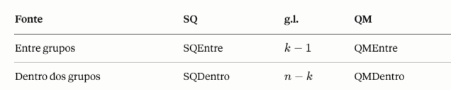
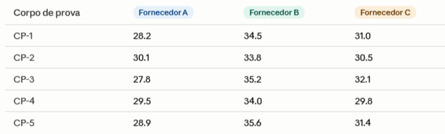
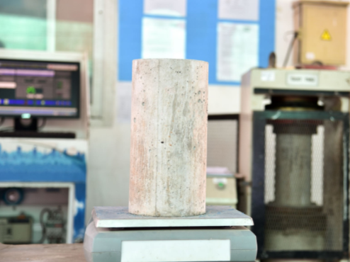

---
# Só mude aqui!!!!
author: "Luiz Gustavo dos Santos"
title: "Relatório 06"
bibliography: referencias.bib
# A partir daqui nao faca alteracoes!!!!!
link-citations: true
csl: associacao-brasileira-de-normas-tecnicas-ipea.csl
subtitle: "<a href='https://bendeivide.github.io/courses/epaec/' target='_blank'>Estatística e Probabilidade</a> </br> <a href='https://bendeivide.github.io' target='_blank'>Prof. Ben Dêivide (DEFIM/CAP/UFSJ)</a>"
include-before-body: header.html
date: now
date-format: "DD/MM/YYYY, HH:mm"
lang: pt-BR
format:
  html:
    toc: true
    number-sections: true
    theme: bootstrap
    #css: styles.css
    code-fold: true
    code-tools: true
execute:
  echo: true
  warning: false
  message: false
---


##  Introdução

A estatística inferencial dispõe de um conjunto de distribuições de probabilidade fundamentais para a realização de testes de hipóteses e a construção de intervalos de confiança. Entre essas distribuições, destacam-se a distribuição qui-quadrado (χ²) e a distribuição F, amplamente empregadas na análise de dados em diversas áreas do conhecimento, como ciências exatas, biológicas, sociais e econômicas.


A distribuição qui-quadrado surge naturalmente quando se somam os quadrados de variáveis aleatórias normais padronizadas e independentes, sendo parametrizada pelo número de graus de liberdade. Suas principais aplicações incluem testes de aderência, testes de independência em tabelas de contingência e inferências sobre a variância populacional.


A distribuição F, por sua vez, é definida como a razão entre duas variáveis qui-quadrado independentes, cada uma dividida pelos seus respectivos graus de liberdade. Essa distribuição ocupa papel central na Análise de Variância (ANOVA) e nos testes de igualdade de variâncias entre populações distintas, sendo essencial para a comparação de modelos estatísticos.


O presente relatório tem como objetivo apresentar as principais propriedades teóricas dessas duas distribuições, discutir suas condições de aplicabilidade e ilustrar seu uso por meio de exemplos práticos. A compreensão aprofundada dessas ferramentas é indispensável para a correta interpretação de resultados estatísticos e para a tomada de decisões fundamentadas em evidências empíricas.


##  Objetivos

### Objetivo geral

 Discorrer sobre as distribuições F e de Qui-quadrado.

### Objetivos específicos

Apresentar como elas podem estar relacionadas a distribuições amostrais;
Quais as funções da amostra que se relacionam com elas;
Por fim, apresentar aplicações dessas distribuições em sua área de atuação.


---


##  Distribuição F de Snedecor-Fisher


A história da Distribuição "F" (também conhecida como Distribuição F de Snedecor ou Distribuição de Fisher-Snedecor) é um dos capítulos mais importantes da consolidação da estatística moderna na década de 1920. Ela nasceu de uma necessidade puramente prática: resolver problemas na agricultura e na genética.


Na década de 1920, desenvolvida pelo matemático e biólogo britânico Sir Ronald Fisher, que trabalhava na Estação Experimental de Rothamsted, na Inglaterra. Seu trabalho envolvia analisar grandes volumes de dados agrícolas para entender, por exemplo, se diferentes tipos de fertilizantes alteravam significativamente a produção de colheitas.


Para resolver isso, Fisher desenvolveu uma técnica revolucionária chamada ***ANOVA (Análise de Variância)***. A ideia central era comparar a variação entre os grupos experimentais com a variação dentro desses grupos. Em 1924, para testar a significância estatística dessa comparação, Fisher criou uma distribuição teórica baseada no logaritmo natural da razão das variâncias. Ele a chamou de Distribuição $z$:


$$z = \frac{1}{2} \ln\left(\frac{s_1^2}{s_2^2}\right)$$

Embora matematicamente brilhante, calcular manualmente os logaritmos e consultar as tabelas de $z$ na época era uma tarefa exaustiva para os pesquisadores.


Entra em cena o estatístico americano George Snedecor, fundador do primeiro departamento de estatística dos Estados Unidos na Iowa State University. Snedecor era um grande entusiasta do trabalho de Fisher, mas queria tornar a aplicação da ***ANOVA*** mais simples e acessível para cientistas de outras áreas.

Em 1934, Snedecor modificou a fórmula de Fisher. Em vez de calcular o logaritmo, ele propôs usar diretamente a razão direta entre as duas variâncias amostrais ($s_1^2/s_2^2$). Para homenagear o criador original do conceito, Ronald Fisher, Snedecor batizou essa nova variável e sua respectiva distribuição de "F".


### Conceito da distribuição F

Segundo @bussab2017estatistica, a Distribuição F descreve o comportamento da razão entre duas variáveis aleatórias independentes, cada uma seguindo uma distribuição Qui-quadrado ($\chi^2$), divididas pelos seus respectivos graus de liberdade ($d_1$ e $d_2$):


$$F = \frac{\chi_1^2 / d_1}{\chi_2^2 / d_2}$$

Ela é completamente definida por dois parâmetros: os graus de liberdade do numerador $(d1)$ e os graus de liberdade do denominador $(d2)$.

**Propriedades fundamentais:**

* Suporte em $(0,+∞)$— assimétrica à direita.


* Média: $\frac{d_2}{d_2 - 2}$  para $d2>2$.


* Relação com a distribuição t: se $T∼t(d)$, então $T²∼F(1,d)$.


* Relação com a distribuição $χ2$: quando $d2→∞d_2$, $d1F→χ(d)²$.


* O recíproco também segue F: se $X∼F(d1,d2)$, então $1/X∼F(d2,d1)$.


Graças ao conhecimento de Snedecor e à genialidade de Fisher, a Distribuição F deixou de ser apenas um conceito abstrato de laboratório agrícola para se transformar na espinha dorsal da inferência estatística moderna, usada hoje desde testes de eficácia de medicamentos até algoritmos de inteligência artificial.


### Quais as funções da amostra que se relacionam com a Distribuição f


Existem três estatísticas amostrais clássicas que se distribuem como F:


 **1 - Razão entre duas variâncias amostrais**


Dadas duas amostras independentes de populações normais, $X1,…,Xn1∼N(μ1,σ12)$ e $Y1,…,Y(n2)∼N(μ2,(σ2)²)$, a estatística:


Sob $H0:(σ1)²=(σ2)²$, os termos $σ²$ se cancelam e $F=(S1)²/(S2)²$ diretamente. Esta é a base do ***teste F de Levene/Bartlett para homocedasticidade***.


**2 - ANOVA — Análise de Variância**


Comparando $k$ grupos com $n$ observações no total, decompõe-se a variação total em duas fontes:




Onde:

SQ - Somas quadráticas

g.l - Grau de liberdade

QM - Médias quadráticas


Sob $H0:μ1=μ2=…=μk$ e normalidade dos erros:

$$F = \frac{\text{QMEntre}}{\text{QMDentro}} \sim F(k - 1, \, n - k)$$


O QMDentro estima $σ²$ sempre (é não-viesado). O QMEntre estima $σ²$ somente quando $H0$ é verdadeira. Quando as médias diferem, o numerador fica inflado e $F$ tende a ser grande — daí o critério de rejeição unilateral na cauda direita.


**3 - Teste F global na regressão linear múltipla**

No modelo $Y=β0+β1X1+…+βpXp+ε$, a tabela ANOVA da regressão produz:


$$F = \frac{SQ_{\text{Reg}}/p}{SQ_{\text{Res}}/(n - p - 1)} \sim F(p, n - p - 1)$$


Este teste avalia $H0:β1=β2=…=βp=0$ — ou seja, se o modelo como um todo tem poder explicativo. Note que o teste tt
t individual para cada $βj$ e o teste $F$ global são complementares: é possível que o $F$ global rejeite $H0$ mesmo quando nenhum $t$ individual seja significativo (multicolinearidade).


***Como tudo se unifica?***


Todos os três casos acima têm a mesma estrutura matemática:


$$F = \frac{\text{variância ''explicada'' / g.l. numerador}}{\text{variância ''residual'' / g.l. denominador}}$$

O denominador sempre estima $σ²$ da população de base. O numerador estima $σ²$ mais o efeito em teste — e sob $H0$, os dois convergem. Por isso a região crítica é sempre a cauda direita da distribuição F: valores grandes de $F$ indicam que o numerador excede o que seria esperado apenas pelo acaso.


Para que as estatísticas acima sigam rigorosamente uma distribuição F, são necessários:


* **Normalidade** das populações de origem (ou amostras grandes, pelo TLC).


* **Independência** entre as observações e entre as amostras.


* **Homocedasticidade** (igualdade de variâncias) na ANOVA e regressão — ironicamente, o mesmo pressuposto que o teste F de variâncias verifica antes dos demais.


A distribuição F é bastante robusta a desvios moderados de normalidade, especialmente para amostras equilibradas, mas viola-se seriamente com heterocedasticidade acentuada.


### Aprofundamento

Neste tópico, trarei algumas aplicações da distribuição F dentro do domínio da engenharia civil, curso que estou em formação.


Um uso clássico da distribuição F em engenharia civil é na comparação de variâncias entre lotes de materiais de construção — especialmente o concreto. O teste F (ANOVA) verifica se diferentes fornecedores, traços ou métodos de cura produzem resistências com variabilidade estatisticamente diferente.


***Análise de Resistência do Concreto***


Um laboratório de controle de qualidade recebe amostras de concreto de 3 fornecedores (A, B e C) e mede a resistência à compressão (MPa) de 5 corpos de prova de cada um. A pergunta é: existe diferença significativa entre as médias dos fornecedores?


***Conceito:*** O teste F da ANOVA compara a variância entre grupos (efeito do fornecedor) com a variância dentro dos grupos (erro experimental):


$$F = \frac{\text{Variância entre grupos (MSB)}}{\text{Variância dentro dos grupos (MSW)}}$$

***Dados:***




**Passo 1 - Parâmetros e hipoteses:**


k = 3 grupos  


n = 5 por grupo  


N = 15 total

$H₀: μA = μB = μC$  (médias iguais)


$H₁$: pelo menos uma média é diferente


Nível de significância: $α = 0,05$


**Passo 2 - Média de cada grupo(Fornecedor) e média total:**


$$x̄ = (Σxᵢ) / n$$

***Fornecedor A:***


$$x̄A = (28.2 + 30.1 + 27.8 + 29.5 + 28.9) / 5$$
$$x̄A = 144.5 / 5 = 28.9 MPa$$

***Fornecedor B:***


$$x̄B = (34.5 + 33.8 + 35.2 + 34 + 35.6) / 5$$


$$x̄B = 173.1 / 5 = 34.62 MPa$$

***Fornecedor C:***

$$x̄C = (31 + 30.5 + 32.1 + 29.8 + 31.4) / 5$$


$$x̄C = 154.8 / 5 = 30.96 MPa$$
***Média total(global):***


$$x̄G = (28.9 + 34.62 + 30.96) × 5 / 15$$


$$x̄G = 472.4 / 15 = 31.4933 MPa$$

**Passo 3 - Soma quadrática entre os grupos(SQE):**

$$SQE = n × Σ(x̄ⱼ − x̄G)²$$


$$(x̄A − x̄G)² = (28.9 − 31.4933)² = (-2.5933)² = 6.7254$$


$$(x̄B − x̄G)² = (34.62 − 31.4933)² = (3.1267)² = 9.776$$


$$(x̄C − x̄G)² = (30.96 − 31.4933)² = (-0.5333)² = 0.2844$$
Multiplicando por $n = 5$, temos:


$$SQE = 5 × (6.7254 + 9.776 + 0.2844)$$


$$SQE = 5 × 16.7859$$


$$SQE = 83.9293$$


**Passo 4 - Soma quadrática dentro dos grupos(SQD):**

Fórmula: 


$$SQD = Σⱼ Σᵢ (xᵢⱼ − x̄ⱼ)²$$


**Fornecedor A** $(x̄A = 28.9):$

$$28.2 − 28.9)² = (-0.7)² = 0.49 (30.1 − 28.9)² = (1.2)² = 1.44 $$


$$(27.8 − 28.9)² = (-1.1)² = 1.21 (29.5 − 28.9)² = (0.6)² = 0.36$$ 


$$(28.9 − 28.9)² = (0)² = 0$$


$$SQD(A) = 3.5$$


**Para o Fornecedor B** $(x̄B = 34.6)$:


$$(34.5 − 34.62)² = (-0.12)² = 0.0144 (33.8 − 34.62)² = (-0.82)² = 0.6724 (35.2 − 34.62)² = (0.58)² = $$

$$0.3364 (34 − 34.62)² = (-0.62)² = 0.3844 (35.6 − 34.62)² = (0.98)² = 0.9604$$


$$SQD(B) = 2.368$$

**Para o Fornecedor C** $(x̄C = 30.96):$


$$(31 − 30.96)² = (0.04)² = 0.0016 (30.5 − 30.96)² = (-0.46)² = $$

$$0.2116 (32.1 − 30.96)² = (1.14)² = 1.2996 (29.8 − 30.96)² =$$


$$(-1.16)² = 1.3456 (31.4 − 30.96)² = (0.44)² = 0.1936$$


$$SQD(C) = 3.052$$


**Soma quadrática total dentro dos grupos(SQD):**


$$SQD = 3.5 + 2.368 + 3.052 = 8.92$$

**Passo 5 - Média quadrática(QM):**


Média quadratica entre os grupos(MQE):

$$MQE = SQE / (k−1)$$

$$MQE = 83.9293 / 2 = 41.9647$$


Média quadrática dentro dos grupos(MQD):


$$MQD = SQD / (N−k)$$

$$MQD = 8.92 / 12 = 0.7433$$

**Médias quadráticas:**

$$MQE = 41.9647$$  


$$MQD = 0.7433$$


**Calculando F:**

Fórmula:

$$F = \frac{\text{MQE}}{\text{MQD}}$$


$$F = \frac{41.9647}{0,7433}$$
$$F = 56.4547$$
Calculando os dados,temos a tabela Anova:


**Passo 7 - Comparando F com o valor crítico:**


Valor crítico da tabela F $(α = 0,05; gl₁ = 2; gl₂ = 12):$


Comparação:

$$(F) calculado = 56.4547$$


$$(F) crítico = 3.885$$


$$56.4547 > 3.885 → Rejeitar (H₀)$$


***Interpretação do engenheiro***

Há diferença estatisticamente significativa entre as médias dos três fornecedores (α = 0,05). O fornecedor B apresenta resistência média (34.62 MPa) muito superior ao A (28.9 MPa) e C (30.96 MPa). O engenheiro de controle de qualidade deve investigar e padronizar o fornecimento.


***Como resolver utilizando o Rstudio?***


```{r}
# ============================================================
# ANOVA - Resistência à Compressão do Concreto (3 Fornecedores)
# Distribuição F - Engenharia Civil
# ============================================================

# --- 1. Dados ---
A <- c(28.2, 30.1, 27.8, 29.5, 28.9)
B <- c(34.5, 33.8, 35.2, 34.0, 35.6)
C <- c(31.0, 30.5, 32.1, 29.8, 31.4)

# Organizar em data frame
resistencia <- c(A, B, C)
fornecedor  <- factor(rep(c("A", "B", "C"), each = 5))
dados       <- data.frame(resistencia, fornecedor)

cat("========== DADOS BRUTOS ==========\n")
print(dados)

# --- 2. Médias por grupo e média global ---
cat("\n========== MÉDIAS ==========\n")
medias <- tapply(resistencia, fornecedor, mean)
print(round(medias, 4))
cat("Média global:", round(mean(resistencia), 4), "MPa\n")

# --- 3. ANOVA manualmente ---
k <- 3; n <- 5; N <- k * n
media_global <- mean(resistencia)

SSB <- n * sum((medias - media_global)^2)
SSW <- sum(tapply(resistencia, fornecedor, function(x) sum((x - mean(x))^2)))
SST <- SSB + SSW

dfB <- k - 1; dfW <- N - k; dfT <- N - 1
MSB <- SSB / dfB
MSW <- SSW / dfW
Fc  <- MSB / MSW

cat("\n========== CÁLCULOS MANUAIS ==========\n")
cat("SSB (entre grupos)  :", round(SSB, 4), "| gl =", dfB, "\n")
cat("SSW (dentro grupos) :", round(SSW, 4), "| gl =", dfW, "\n")
cat("SST (total)         :", round(SST, 4), "| gl =", dfT, "\n")
cat("MSB                 :", round(MSB, 4), "\n")
cat("MSW                 :", round(MSW, 4), "\n")
cat("F calculado         :", round(Fc,  4), "\n")

# --- 4. Valor crítico e p-valor ---
alpha   <- 0.05
F_crit  <- qf(1 - alpha, dfB, dfW)
p_valor <- pf(Fc, dfB, dfW, lower.tail = FALSE)

cat("\n========== DECISÃO ==========\n")
cat("F crítico (α=0,05; gl 2,12):", round(F_crit, 4), "\n")
cat("p-valor                     :", format(p_valor, scientific = TRUE, digits = 4), "\n")
if (Fc > F_crit) {
  cat("Conclusão: F calc > F crítico → REJEITA H₀\n")
  cat("Há diferença significativa entre os fornecedores.\n")
} else {
  cat("Conclusão: F calc <= F crítico → NÃO rejeita H₀\n")
}

# --- 5. ANOVA via função nativa (confirmação) ---
cat("\n========== ANOVA (aov) ==========\n")
modelo <- aov(resistencia ~ fornecedor, data = dados)
print(summary(modelo))

# --- 6. Gráfico da Distribuição F com região crítica ---
x     <- seq(0, 9, length.out = 500)
y     <- df(x, dfB, dfW)
x_reg <- seq(F_crit, 9, length.out = 300)
y_reg <- df(x_reg, dfB, dfW)

plot(x, y, type = "l", lwd = 2, col = "#185FA5",
     xlab = "F", ylab = "Densidade",
     main = "Distribuição F (gl: 2, 12) — ANOVA Resistência do Concreto")

polygon(c(x_reg, rev(x_reg)), c(y_reg, rep(0, length(y_reg))),
        col = rgb(0.64, 0.18, 0.18, 0.3), border = NA)

abline(v = F_crit, col = "#A32D2D", lty = 2, lwd = 1.5)
abline(v = Fc,     col = "#185FA5", lty = 2, lwd = 1.5)

text(F_crit + 0.15, max(y) * 0.6,
     paste0("F crítico\n", round(F_crit, 2)),
     col = "#A32D2D", cex = 0.85, adj = 0)
text(Fc + 0.15, max(y) * 0.4,
     paste0("F calc\n", round(Fc, 2)),
     col = "#185FA5", cex = 0.85, adj = 0)

legend("topright",
       legend = c("Distribuição F", "Região crítica (α=0,05)",
                  paste0("F crítico = ", round(F_crit, 2)),
                  paste0("F calc = ",    round(Fc, 2))),
       col    = c("#185FA5", rgb(0.64,0.18,0.18,0.5), "#A32D2D", "#185FA5"),
       lty    = c(1, NA, 2, 2),
       pch    = c(NA, 15, NA, NA),
       lwd    = 2, cex = 0.85, bty = "n")
```


## Distribuição Qui-quadrado


A história da distribuição qui-quadrado começa muito antes do nome que ela carrega hoje, e envolve alguns dos maiores personagens da estatística moderna.


O primeiro a encontrar essa distribuição foi o matemático e geodesista alemão Friedrich Robert Helmert em 1875. Ele estava trabalhando com erros de medição em levantamentos topográficos — um problema muito prático: como quantificar a incerteza acumulada quando se somam vários erros de observação? Ao estudar a distribuição da soma dos quadrados de erros normais, Helmert derivou matematicamente o que hoje chamamos de distribuição qui-quadrado, embora sem dar esse nome nem perceber toda a extensão de sua aplicação estatística. Seu trabalho ficou restrito ao campo da geodésia e passou décadas praticamente ignorado fora da Alemanha.


A distribuição ganhou fama e nome com o estatístico britânico Karl Pearson, em um artigo publicado em 1900 que se tornaria um dos mais citados de toda a história da estatística: "On the criterion that a given system of deviations from the probable in the case of a correlated system of variables is such that it can be reasonably supposed to have arisen from random sampling". O título é longo, mas a ideia era poderosa: Pearson queria um método para comparar frequências observadas em dados reais com frequências teoricamente esperadas. Ele estava insatisfeito com a ausência de ferramentas rigorosas para julgar se um modelo se ajustava bem aos dados. A estatística que ele propôs — a soma de quadrados das diferenças entre observado e esperado, dividida pelo esperado — seguia exatamente a distribuição que Helmert havia derivado 25 anos antes. Pearson usou a letra grega χ (chi) na notação, e o nome ficou.
A motivação de Pearson era predominantemente biológica e social. Ele fazia parte do movimento da biometria, que tentava aplicar métodos matemáticos rigorosos à biologia e às ciências humanas, e precisava de ferramentas para testar se distribuições de características físicas, dados demográficos e padrões hereditários correspondiam ao que as teorias previam.


A grande controvérsia da distribuição qui-quadrado veio duas décadas depois, protagonizada por Ronald Aylmer Fisher, que na época era um jovem estatístico ainda construindo sua reputação. Fisher identificou um erro sério no trabalho de Pearson: o cálculo dos graus de liberdade estava errado.
Pearson calculava os graus de liberdade simplesmente como o número de categorias menos um. Fisher demonstrou, com rigor matemático, que toda vez que um parâmetro é estimado a partir dos próprios dados — a média, a variância, uma probabilidade — isso consome um grau de liberdade adicional. O teste de Pearson, portanto, produzia p-valores incorretos sempre que os parâmetros da distribuição teórica eram estimados da amostra, e não conhecidos de antemão.
A relação entre os dois homens era péssima. Pearson era o editor do principal periódico de estatística da época e recusou publicar vários artigos de Fisher. A disputa foi pessoal, durou décadas e só terminou com a morte de Pearson em 1936. Mas a história deu razão a Fisher: a correção dos graus de liberdade é hoje ensinada em todo curso introdutório de estatística.


A partir dos anos 1930, com o amadurecimento da teoria da inferência estatística — impulsionada pelos trabalhos de Fisher, Neyman e Egon Pearson (filho de Karl) —, a distribuição qui-quadrado se firmou como uma das distribuições fundamentais da estatística. Ela aparece naturalmente em pelo menos três contextos distintos: nos testes de aderência e independência (herança direta de Karl Pearson), na inferência sobre variâncias de populações normais, e como caso especial de distribuições mais gerais, como a distribuição gama. Também está no coração de outras distribuições importantes: a distribuição t de Student e a distribuição F, ambas fundamentais na análise de experimentos, são construídas a partir de variáveis qui-quadrado.

Hoje a distribuição qui-quadrado está em praticamente todas as áreas do conhecimento que usam dados categóricos ou estimativas de variância: da genética mendeliana à engenharia de qualidade, da epidemiologia ao controle de processos industriais, do jornalismo de dados às ciências climáticas. O que começou como uma solução para um problema de geodésia alemã do século XIX tornou-se uma das ferramentas mais universais da ciência quantitativa.


### Conceito da distribuição Qui-quadrado


A intuição é simples e bonita. Se você toma uma variável com distribuição normal padrão e a eleva ao quadrado, o resultado nunca pode ser negativo — e tende a ser pequeno quando a variável original está próxima de zero, com caudas longas quando ela se afasta. Somar vários desses quadrados produz uma distribuição que começa no zero, é fortemente assimétrica à direita com poucos termos, e vai se tornando progressivamente mais simétrica e parecida com uma curva normal à medida que se somam mais termos. O parâmetro que controla tudo isso é o número de termos somados, que chamamos de graus de liberdade.


De acordo com @bussab2017estatistica, a distribuição qui-quadrado responde a uma pergunta simples: o que acontece quando você pega várias medidas com erro aleatório, eleva cada uma ao quadrado e soma tudo? O resultado dessa soma não segue uma distribuição normal — ele segue uma distribuição qui-quadrado.
Mais formalmente: se você tem ν variáveis independentes, cada uma com distribuição normal padrão (média zero, variância um), e soma os quadrados de todas elas, o resultado segue uma distribuição qui-quadrado com ν graus de liberdade:


$$χ²(ν) = Z₁² + Z₂² + … + Zᵥ²$$

Esse é o ponto de partida de tudo.


**Por que elevar ao quadrado?**

Quando se mede algo no mundo real, o erro de medição pode ser positivo ou negativo. Se você simplesmente somasse os erros, eles se cancelariam. Ao elevar ao quadrado, duas coisas acontecem: o sinal desaparece — todo erro vira positivo — e os erros grandes ganham peso desproporcional. A soma dos quadrados é, portanto, uma medida de magnitude total dos desvios, sem cancelamento. É exatamente isso que se quer quando se pergunta "o quanto os dados se afastam do esperado?".

**A forma da curva**


A distribuição qui-quadrado tem características visuais bem marcantes que derivam diretamente de sua construção:
É sempre positiva, porque é uma soma de quadrados e quadrado nunca é negativo. É assimétrica à direita, especialmente com poucos graus de liberdade — a curva começa no zero, sobe rapidamente, atinge um pico e depois tem uma cauda longa para a direita. Com muitos graus de liberdade, pela lei dos grandes números, a distribuição vai se tornando mais simétrica e se aproximando de uma curva normal. Seus dois parâmetros principais são a média, que é igual a ν, e a variância, que é igual a 2ν — ambas crescem conforme se aumentam os graus de liberdade.


**Os graus de liberdade**


O conceito de graus de liberdade é o coração da distribuição qui-quadrado. Eles representam o número de informações independentes disponíveis no cálculo. Cada restrição imposta aos dados — como estimar uma média, fixar um total — consome um grau de liberdade. Se você tem 5 categorias mas sabe que as frequências somam 100, já não tem 5 informações independentes: tem 4. Por isso o grau de liberdade nesse caso é 4, não 5. Foi exatamente esse ponto que Fisher corrigiu em Pearson: parâmetros estimados a partir dos dados reduzem os graus de liberdade disponíveis para o teste.

**A estatística do teste**


Na prática, o qui-quadrado aparece como uma estatística de teste que mede o quanto os dados observados se distanciam do que seria esperado sob uma hipótese nula. A fórmula é:

$$χ² = Σ (O − E)² / E$$
onde O é a frequência observada em cada categoria e E é a frequência esperada segundo o modelo teórico. Dividir pelo valor esperado normaliza a diferença — um desvio de 10 unidades é muito mais relevante quando o esperado era 15 do que quando o esperado era 1000. Quanto maior o valor calculado, mais os dados se afastam do modelo. Se esse valor cair na cauda direita da distribuição — além do valor crítico para o nível de significância escolhido — rejeita-se a hipótese nula.


**Os três grandes usos do teste**


O mesmo raciocínio se aplica em três situações distintas, cada uma com sua variação de graus de liberdade:
No teste de aderência, verifica-se se uma amostra segue uma distribuição teórica específica — por exemplo, se dados de precipitação seguem uma distribuição normal ou se defeitos em um lote seguem uma distribuição de Poisson. No teste de independência, organiza-se os dados em uma tabela de contingência e verifica-se se duas variáveis categóricas são independentes entre si — por exemplo, se o tipo de falha estrutural é independente do fornecedor do material. No teste de variância, usa-se o qui-quadrado para fazer inferência sobre a variância populacional de uma distribuição normal — verificar se ela é igual a um valor especificado, ou construir um intervalo de confiança para ela.

### Distribuções a partir da distribuição Qui-quadrado


A distribuição qui-quadrado não existe isolada — ela é a mãe de outras distribuições fundamentais da estatística. A ***distribuição  de T-Student***, usada para comparar médias com amostras pequenas, é construída dividindo uma normal padrão pela raiz quadrada de uma qui-quadrado dividida por seus graus de liberdade:

$$f(t) = \frac{\Gamma\left(\frac{\nu+1}{2}\right)}{\sqrt{\nu\pi}\,\Gamma\left(\frac{\nu}{2}\right)} \left(1 + \frac{t^2}{\nu}\right)^{-\frac{\nu+1}{2}}$$


A ***distribuição F***, usada na ANOVA, é a razão entre duas variáveis qui-quadrado cada uma dividida por seus respectivos graus de liberdade:

$$F = \frac{\frac{Y_1}{\nu_1}}{\frac{Y_2}{\nu_2}}$$


Compreender o qui-quadrado é, portanto, compreender a estrutura profunda de boa parte da inferência estatística clássica. Há uma forma elegante de pensar no qui-quadrado geometricamente. Uma variável normal padrão Z representa uma posição em uma reta. Z² representa o quadrado da distância dessa posição até a origem. Somar ν dessas quantidades é como medir o quadrado da distância de um ponto até a origem em um espaço de ν dimensões. A distribuição qui-quadrado descreve como essa distância ao quadrado se distribui quando o ponto é gerado aleatoriamente a partir de uma normal multivariada padrão. É uma medida de quão longe do centro o acaso pode levar — e com que frequência.


### Funções da amostra que se relacionam com a distribuição Qui-quadrado

Na estatística inferencial, as "funções da amostra" que se relacionam com uma distribuição teórica são chamadas de estatísticas amostrais ou estimadores. Quando estamos trabalhando com populações que seguem uma distribuição Normal, existem duas funções principais dos dados da amostra que se conectam diretamente com a distribuição Qui-Quadrado ($\chi^2$). Elas fundamentam os testes de hipóteses sobre variâncias e testes de aderência/independência.


**1 -  A Variância Amostral Corrigida (S²)**


Esta é a relação mais pura e direta na estatística paramétrica. Se você extrair uma amostra de tamanho $n$ de uma população normal com variância populacional conhecida $\sigma^2$, a variância calculada a partir da amostra ($S^2$) pode ser transformada em uma variável Qui-Quadrado através da seguinte função:


$$\frac{(n - 1)S^2}{\sigma^2} \sim \chi^2_{(n - 1)}$$


Ela pega a variância da sua amostra ($S^2$), multiplica pelos graus de liberdade ($n-1$) e padroniza dividindo pela variância real da população ($\sigma^2$). O resultado desse cálculo segue estritamente uma distribuição Qui-Quadrado com $n-1$ graus de liberdade. É essa função que nos permite criar intervalos de confiança e fazer testes de hipóteses para descobrir se a variância de um processo mudou.


**2 - A Estatística de Teste de Pearson (Frequências Amostrais)**


Na estatística não-paramétrica, a função da amostra muda o foco de "médias e variâncias" para a contagem de dados (frequências). Se você categorizar sua amostra, a relação com o Qui-Quadrado surge ao comparar o que você observou com o que era esperado:

$$\chi^2 = \sum \frac{(O_i - E_i)^2}{E_i}$$


Onde as funções da amostra são:


* $O_i$ (Frequência Observada): A função de contagem direta de quantos elementos da sua amostra caíram em determinada categoria $i$.


* $E_i$ (Frequência Esperada): O número de elementos esperado para aquela categoria se a sua hipótese nula fosse verdade (calculada combinando o tamanho total da amostra $n$ com as probabilidades teóricas).

### Aprofundamento

Na engenharia civil, a distribuição Qui-Quadrado é amplamente utilizada no controle de qualidade de materiais, especialmente no monitoramento da variabilidade do concreto.

Na prática, a resistência média do concreto é importante, mas a sua variabilidade (o quão instável é a mistura que chega dos caminhões betoneira) é o que define se uma estrutura é segura ou corre risco de colapso.


***Controle de Qualidade do Concreto ($f_{ck}$)***


Imagine que você é o engenheiro responsável pela construção de um edifício de múltiplos pavimentos. O projeto estrutural exige um concreto com resistência característica à compressão ($f_{ck}$) de 30 MPa.Para garantir a segurança, a usina de concreto contratada afirma que o processo de mistura deles é altamente controlado, operando com uma variância histórica máxima de $\sigma^2 = 4,0 \text{ MPa}^2$ (o que significa um desvio padrão $\sigma = 2,0 \text{ MPa}$). Se a variância for maior do que isso, o concreto começará a apresentar falhas localizadas perigosas.Para fiscalizar o fornecedor, você coleta corpos de prova cilíndricos ao longo de uma semana.





**Dados Coletados**


* Tamanho da amostra ($n$): 21 corpos de prova rompidos na prensa hidráulica aos 28 dias.


* Graus de liberdade ($\nu$): $n - 1 = 20$.


* Variância calculada na sua amostra ($S^2$): $7,5 \text{ MPa}^2$.


Repare que a variância amostral ($7,5$) foi bem maior que a prometida pela usina ($4,0$). Será que essa diferença foi apenas uma oscilação ao acaso da amostra ou a usina perdeu o controle de qualidade do processo?


**Passo 1 - Aplicando a Função Qui-Quadrado:**


Para tomar uma decisão técnica e embasada, montamos o teste de hipóteses usando a função da variância amostral:

$$\chi^2_{\text{calculado}} = \frac{(n - 1)S^2}{\sigma^2}$$


Substituindo os valores da obra:


$$\chi^2_{\text{calculado}} = \frac{(21 - 1)S^2}{7,5}$$
$$\chi^2_{\text{calculado}} = \frac{150}{4} = 37,5$$
**A Decisão Estatística**


Agora, você consulta a tabela teórica da distribuição Qui-Quadrado disponivel em @unicampQuiQuadrado  para 20 graus de liberdade, adotando um nível de significância padrão de 5% ($\alpha = 0,05$) para o erro.


$\chi^2_{\text{crítico}}$ na tabela (para $\nu = 20$ e $\alpha = 0,05$): $31,41$


***Interpretação do engenheiro***

Como o seu valor calculado ($37,5$) é maior do que o limite crítico da tabela ($31,41$), o resultado cai na região de rejeição da hipótese de controle.

Veredito técnico: Há evidências estatísticas de que a variabilidade do concreto entregue é excessiva e está fora dos padrões contratados. Como engenheiro da obra, você tem justificativa matemática para notificar a usina fornecedora, exigir correções no traço do concreto ou recusar os próximos lotes até que o processo seja estabilizado.

***Como resolver utilizando o Rstudio?***

```{r}
# ============================================================
# TESTE DE HIPÓTESE PARA VARIÂNCIA - Qui-Quadrado
# ============================================================

# --- Dados do problema ---
n        <- 21
nu       <- n - 1
S2       <- 7.5
sigma2_0 <- 4.0
alpha    <- 0.05

# --- Estatística de teste ---
chi2_calc   <- (nu * S2) / sigma2_0
chi2_critico <- qchisq(1 - alpha, df = nu)
p_valor     <- pchisq(chi2_calc, df = nu, lower.tail = FALSE)

cat("=== ESTATÍSTICA DE TESTE ===\n")
cat(sprintf("χ² calculado = %.4f\n", chi2_calc))
cat(sprintf("χ² crítico   = %.4f\n", chi2_critico))
cat(sprintf("p-valor      = %.6f\n", p_valor))

if (chi2_calc > chi2_critico) {
  cat("Decisão: REJEITA H0 — variância supera 4,0 MPa²\n")
} else {
  cat("Decisão: NÃO rejeita H0\n")
}

# --- Gráfico ---
library(ggplot2)

x_vals <- seq(0, 60, length.out = 500)
df_plot <- data.frame(
  x = x_vals,
  y = dchisq(x_vals, df = nu)
)

ggplot(df_plot, aes(x, y)) +
  geom_area(
    data = subset(df_plot, x >= chi2_critico),
    aes(x, y), fill = "#e74c3c", alpha = 0.5
  ) +
  geom_line(color = "#2c3e50", linewidth = 1.2) +
  geom_vline(xintercept = chi2_critico, color = "#e74c3c",
             linetype = "dashed", linewidth = 1) +
  geom_vline(xintercept = chi2_calc, color = "#2980b9",
             linetype = "solid", linewidth = 1.2) +
  annotate("text", x = chi2_critico + 1, y = 0.055,
           label = sprintf("χ²_crit\n= %.2f", chi2_critico),
           color = "#e74c3c", hjust = 0, size = 3.5) +
  annotate("text", x = chi2_calc + 1, y = 0.040,
           label = sprintf("χ²_calc\n= %.2f", chi2_calc),
           color = "#2980b9", hjust = 0, size = 3.5) +
  labs(
    title    = "Teste Qui-Quadrado para Variância",
    subtitle = sprintf("H0: σ² ≤ %.1f MPa²  |  H1: σ² > %.1f MPa²  |  gl = %d",
                       sigma2_0, sigma2_0, nu),
    x        = "χ²",
    y        = "Densidade",
    caption  = sprintf("p-valor = %.4f  |  Decisão: %s H0",
                       p_valor,
                       ifelse(p_valor < alpha, "REJEITAR", "NÃO REJEITAR"))
  ) +
  theme_minimal(base_size = 13) +
  theme(
    plot.title    = element_text(face = "bold"),
    plot.subtitle = element_text(color = "gray40"),
    plot.caption  = element_text(
      face  = "bold",
      color = ifelse(p_valor < alpha, "#e74c3c", "#27ae60")
    )
  )
```


---

##  Metodologia


Para a elaboração deste relatório foram utilizados os materiais de pesquisa @bussab2017estatistica, @mood1974introduction e @casella2002statistical, para a parte de documentação, foi utilizado os aprendizados do @Rbasico2022, ministrado pelo professor Ben Dêivide alem dos conteudos ensinados em sala de aula. A parte de documentação foi feita utilizando o Rstudio, juntamente com o Rmarkdown e latex.


---


##  Considerações finais

Ao longo deste relatório, foram exploradas as distribuições qui-quadrado e F, abordando desde seus fundamentos teóricos até suas relações com as funções de amostra que lhes dão origem. Essa análise conjunta permitiu compreender não apenas as propriedades intrínsecas de cada distribuição, mas também a profunda conexão que existe entre elas e os mecanismos de amostragem a partir de populações normais.


No que diz respeito às funções de amostra, ficou evidente que a distribuição qui-quadrado emerge de forma natural como distribuição da variância amostral padronizada, enquanto a distribuição F se manifesta na comparação entre duas variâncias amostrais independentes. Essa ligação entre os estimadores amostrais e as distribuições teóricas é o que confere a ambas sua relevância prática: elas não são construções abstratas, mas reflexos diretos do comportamento de estatísticas calculadas a partir de dados reais.


Do ponto de vista aplicado, as distribuições estudadas se mostram ferramentas indispensáveis da inferência estatística. A distribuição qui-quadrado fundamenta testes sobre variâncias populacionais e análises de associação entre variáveis categóricas, enquanto a distribuição F sustenta a Análise de Variância e os testes de comparação entre modelos, sendo ambas complementares em situações que envolvem a decomposição da variabilidade dos dados.


Por fim, conclui-se que o domínio dessas distribuições e de suas respectivas funções de amostra associadas constitui um requisito fundamental para a prática estatística rigorosa. A correta identificação de quando e como aplicá-las garante maior confiabilidade nas inferências realizadas e contribui para interpretações mais precisas e fundamentadas dos fenômenos estudados.

##  Referências