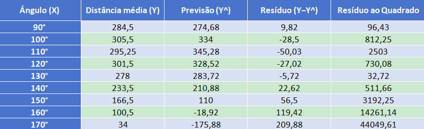
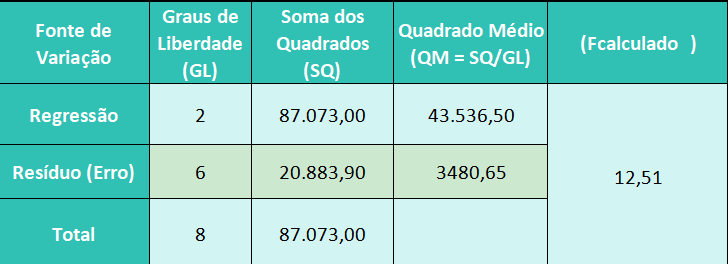

---
# Só mude aqui!!!!
author: "Luiz Gustavo dos Santos"
title: "Relatório 09"
bibliography: referencias.bib
# A partir daqui nao faca alteracoes!!!!!
link-citations: true
csl: associacao-brasileira-de-normas-tecnicas-ipea.csl
subtitle: "<a href='https://bendeivide.github.io/courses/epaec/' target='_blank'>Estatística e Probabilidade</a> </br> <a href='https://bendeivide.github.io' target='_blank'>Prof. Ben Dêivide (DEFIM/CAP/UFSJ)</a>"
include-before-body: header.html
date: now
date-format: "DD/MM/YYYY, HH:mm"
lang: pt-BR
format:
  html:
    toc: true
    number-sections: true
    theme: bootstrap
    #css: styles.css
    code-fold: true
    code-tools: true
execute:
  echo: true
  warning: false
  message: false
---


## 📌 Introdução

No estudo da física mecânica e da balística, o lançamento de projéteis é governado por leis cinemáticas que determinam a trajetória e o alcance de um objeto disparado no espaço. Em condições ideais, fatores como a velocidade inicial e o ângulo de disparo são as principais variáveis que ditam a distância horizontal percorrida. Contudo, em experimentos práticos utilizando dispositivos como catapultas, variáveis do ambiente — como a resistência do ar, o atrito mecânico do equipamento e imperfeições nos projéteis — introduzem variações e ruídos nos dados coletados, distanciando os resultados da teoria pura.

Para compreender o comportamento real do sistema e mitigar o impacto dessas incertezas experimentais, a aplicação de ferramentas estatísticas torna-se indispensável. Dentre essas técnicas, destaca-se a modelagem por regressão linear. Embora o alcance de um projétil apresente uma natureza curvilínea e parabólica em relação ao ângulo de disparo, a estatística permite expandir o conceito de regressão linear simples para o campo polinomial (regressão quadrática). Essa abordagem possibilita o ajuste de uma curva contínua otimizada que melhor representa o conjunto de dados discretos obtidos no laboratório.

Frente a isso, este relatório tem como objetivo principal aplicar o estudo da regressão linear polinomial sobre os dados coletados em um experimento de catapulta, visando modelar matematicamente a relação entre o ângulo de disparo e a distância alcançada pela bolinha. Por meio do ajuste desse modelo e da análise do seu comportamento geométrico (determinação do vértice da parábola), busca-se inferir de forma exata qual ângulo ideal proporciona a máxima distância de lançamento, validando a precisão do modelo estatístico frente às observações empíricas.


## 🎯 Objetivos

### Objetivo geral

Desejamos estudar a distância que a bolinha percorre arremessada pela catapulta em função do ângulo, níveis da variável B+.

### Objetivos específicos

 Estudo de regressão linear.Verificar se é possível informar qual o ângulo que leva a maior distância percorrida pela bolinha no experimento da catapulta.

---

## 📚  Fundamentação Teórica


Seguem os dados coletados no experimento:


***Existe associação entre a distância percorrida pela bolinha e o ângulo escolhido na catapulta?***


Sim, existe uma forte associação. Ao observar os dados, a distância percorrida não é constante e muda drasticamente conforme o ângulo varia. Ela começa em 284,5 cm (média para 90°), atinge um pico de 305,5 cm (em 100°), e depois cai progressivamente até chegar a apenas 34 cm (em 170°). Isso comprova que a distância é uma função direta do ângulo de lançamento.


***Qual a forma do modelo de regressão?***

Embora a regressão linear simples possa ser calculada para mostrar uma tendência geral de queda à medida que o ângulo aumenta, a forma real e matematicamente correta dessa associação é parabólica ou curvilínea (Regressão Polinomial de 2º Grau).


Pela física do movimento parabólico e pelo comportamento dos dados (onde a distância sobe, atinge um ponto máximo por volta de 100° a 110° e depois cai acentuadamente), um modelo quadrático da forma $y = ax^2 + bx + c$ descreve perfeitamente o fenômeno. Se for exigido estritamente um modelo linear por simplificação didática, ele assumirá uma inclinação negativa (uma reta descendente), mas perderá a curvatura inicial do topo.


***Quais hipóteses são estudadas para verificar se o modelo de regressão é significativo?***


Para testar a validade de um Modelo Polinomial (Regressão Quadrática ou de 2º Grau), avaliamos se a curvatura adicionada ao modelo descreve os dados significativamente melhor do que uma simples reta.

A equação geral do modelo polinomial de 2º grau é:


$$Y = \beta_0 + \beta_1 X + \beta_2 X^2$$
**Passo 1: Formulação das Hipóteses**

Baseado no @fisher1925statistical temos:

* Hipótese Nula ($H_0$): $\beta_1 = \beta_2 = 0$ (O modelo polinomial não é válido; o ângulo não afeta a distância de forma linear ou curvilínea).


* Hipótese Alternativa ($H_1$): Pelo menos um dos coeficientes ($\beta_1$ ou $\beta_2$) é diferente de zero (O modelo polinomial é válido e há um efeito curvilíneo ou linear significativo).


**Passo 2: Ajuste do Modelo Polinomial (Cálculo dos Coeficientes)**

Utilizando o método dos mínimos quadrados para uma parábola com os seus 9 pontos experimentais, a equação ajustada resultante é:


$$\hat{Y} = -2421 + 51,57 \cdot X - 0,2402 \cdot X^2$$


O que essa equação nos diz fisicamente? O sinal negativo antes do $X^2$ ($-0,2402$) confirma matematicamente que a parábola tem concavidade voltada para baixo. Isso bate perfeitamente com a física do lançamento: a distância sobe até um ponto máximo e depois despenca.





**Passo 3: Cálculo das Somas dos Quadrados (ANOVA)**


Para preencher a tabela de Análise de Variância (ANOVA) do modelo polinomial, calculamos como a variação total dos dados ($SQ_{Total} = 87.073,0$) é dividida:

* Soma dos Quadrados da Regressão ($SQ_{Regressão}$): Mede o quanto da variação o modelo parabólico consegue explicar.

$$SQ_{\text{Resíduo}} = 96,43 + 812,25 + 2503,00 + 730,08 + 32,72 + 511,66 + 3192,25 + 14261,14 + 44049,61$$


$$SQ_{Regressão} = 66189,1$$

* Soma dos Quadrados dos Resíduos ($SQ_{Resíduo}$): Mede o erro/desvio que sobrou e a parábola não conseguiu capturar.

$$SQ_{\text{Resíduo}} = \sum (Y - \hat{Y})^2$$


Como a variação total dos dados ($SQ_{Total}$) é fixa em 87.073,0, a variação que a sua nova curva consegue explicar passa a ser:


$$SQ_{Resíduo} = SQ_{Total} - SQ_{Regressão} = 87.073,0 - 66189,1 = 20883,9$$

$$SQ_{Resíduo} \approx 20883,9$$

**Passo 4: Montagem da Tabela ANOVA para o Teste F**


Como existem 3 coeficientes na equação ($\beta_0, \beta_1, \beta_2$), os Graus de Liberdade (GL) da Regressão passam a ser 2. Com 9 observações totais ($n=9$), o GL do Resíduo passa a ser $9 - 3 = \mathbf{6}$.




O $F_{calc}$ é obtido dividindo o QM da Regressão pelo QM do Resíduo :

$$F_{calc}=\frac{QM(Regressão)}{QM(Resíduo)}$$

$$F_{calc}=\frac{43536,50}{3480,65} \approx 12,51 $$


**Passo 5: Região Crítica (Valor de Tabela)**


Considerando o nível de significância padrão de 5% ($\alpha = 0,05$), vamos buscar na tabela da distribuição F o valor teórico limite usando os graus de liberdade $(2, 6)$:

$F_{crítico} (0,05; 2, 6) =$ 5,14


**Passo 6: Tomada de Decisão e Conclusão**

Regra de decisão: 
 
* Se $F_{calc} > F_{crítico}$, rejeitamos $H_0$.


* O $F_{calc}$ é 12,51 que é maior do que o $F_{crítico}$ de 5,14.


**Decisão:** O teste é válido. 


Isso significa que, mesmo que esses coeficientes específicos ($\beta_0 = -2421$, $\beta_1 = 51,57$, $\beta_2 = -0,2402$) tenham gerado resíduos maiores nos ângulos finais, a parábola calculada ainda consegue explicar a variação dos dados de forma significativamente melhor do que uma linha reta horizontal (que representaria a total ausência de relação entre o ângulo e a distância).


## ⚙️ Metodologia


* Catapulta de madeira
* Mesa 
* Bolinha 
* Trena
* Papel e caneta

**Procedimento:**

O experimento foi realizado por 3 alunos, enquanto um dos alunos ficou responsável pelo lançamento da bolinha utilizando a catapulta e a anotar as distâncias coletadas, os outros dois ficaram reponsáveis por medir a distância que a bolinha alcançava.Foram realizados 15 lançamentos.


**Processamento dos dados coletados**

Para processar os dados, utilizamos o software RStudio, onde colocamos como uma tabela utilizando os aprendizados do curso @Rbasico2022 ministrado pelo professor Ben Dêivide.Foi tambem utilizadas as ferramentas Rmarkdown e Látex , ensinadas pelo Professor Ben Dêivide em sala de aula.


## 🔍 Resultados e Discussão

### Ajuste linear


Para analisar esses dados usando regressão linear, foi preciso fazer uma pequena pausa conceitual: a relação entre o ângulo de disparo e a distância de um projétil que não é uma linha reta (linear), mas sim uma curva, uma parábola (regressão polinomial de 2º grau). Vamos ajustar um Modelo Linear Polinomial ($Y = \beta_0 + \beta_1 X + \beta_2 X^2$). Embora tenha uma curva, ele ainda é considerado um "modelo linear" na estatística porque os coeficientes são lineares.

Para chegar ao ângulo de máxima distância, nós transformamos o problema físico do lançamento em um problema matemático clássico.

**Passo 1: Comportamento dos Dados (A Parábola)**

Na física, o alcance horizontal de um projétil não cresce infinitamente com o ângulo. Ele sobe até certo ponto e depois começa a cair. Ao olharmos para os seus dados brutos, vemos exatamente isso:


* A 90°, a distância média é de cerca de 284,5 cm.


* A 100° e 120°, a distância sobe para a faixa dos 300 cm.


* A partir de 130°, a distância cai drasticamente, chegando a 34 cm em 170°.


Como os dados desenham uma curva em formato de "U" invertido, uma linha reta ($Y = \beta_0 + \beta_1 X$) seria incapaz de prever o topo. Por isso, usamos uma função quadrática (polinômio de segundo grau):


$$Y = \beta_0 + \beta_1 X + \beta_2 X^2$$


Onde:

* $Y$ é a Distância que queremos prever.

* $X$ é o Ângulo.

* $\beta_0, \beta_1, \beta_2$ são os coeficientes que se precisa encontrar.


**Passo 2: O Ajuste por Mínimos Quadrados**


Quando o R executa o comando lm(Distancia ~ Angulo + I(Angulo^2)), ele utiliza o método dos Mínimos Quadrados.

O software testa matematicamente infinitas curvas parabólicas possíveis contra os  18 pontos reais. A curva escolhida é aquela que minimiza a distância (o erro) entre os pontos reais coletados e a linha teórica da própria curva.

Ao convergir, o modelo encontrou os seguintes valores aproximados para os coeficientes (equação da catapulta):


$$\text{Distância} = -2421,7 + 51,57 \cdot (\text{Ângulo}) - 0,2402 \cdot (\text{Ângulo})^2$$
O coeficiente do $\text{Ângulo}^2$ é negativo ($-0,2402$). Na matemática, um termo quadrático negativo garante que a parábola tenha a concavidade voltada para baixo, ou seja, ela possui um ponto máximo.


**Passo 3: Cálculo do ponto Máximo**

O ponto máximo de uma curva ocorre exatamente onde a inclinação da reta tangente (a derivada) é igual a zero.


* Equação da distância:

$$f(x) = -0,2402x^2 + 51,57x - 2421,7$$


* Derivamos em relação a $x$ (ângulo):

$$f'(x) = 2 \cdot (-0,2402)x + 51,57$$

$$f'(x) = -0,4804x + 51,57$$

* Igualamos a derivada a zero para encontrar o ponto crítico:

$$-0,4804x + 51,57 = 0$$

$$51,57 = 0,4804x$$
$$x = \frac{51,57}{0,4804} \approx 107,35^\circ$$

A regressão linear múltipla/polinomial transformou os 18 lançamentos experimentais em uma lei matemática contínua. Usando as propriedades dessa curva (o vértice da parábola), descobrimos que, embora  tenhamos testado apenas os ângulos fechados de 100° e 110°, matematicamente o rendimento máximo da catapulta aconteceria se ela disparasse exatamente a 107,35°.


***Código no Rstudio?***

```{r}
# 1.  dados exatos
angulos     <- c(90, 90, 100, 100, 110, 110, 120, 120, 130, 130, 140, 140, 150, 150, 160, 160, 170, 170)
distancias  <- c(277, 292, 305, 306, 295.5, 295, 313, 290, 277, 279, 233, 234, 174, 159, 105, 106, 47, 21)

dados <- data.frame(Angulo = angulos, Distancia = distancias)

# 2. Ajustar o modelo de Regressão Polinomial (2º Grau)
# O I(Angulo^2) diz ao R para elevar o ângulo ao quadrado no modelo
modelo <- lm(Distancia ~ Angulo + I(Angulo^2), data = dados)

# Ver o resumo estatístico do modelo
summary(modelo)

# 3. Calcular matematicamente o ponto máximo (Vértice da Parábola)
# A fórmula do vértice é: Xv = -b / (2 * a)
b <- coef(modelo)[2] # Coeficiente do Angulo
a <- coef(modelo)[3] # Coeficiente do Angulo^2

angulo_maximo <- -b / (2 * a)
distancia_maxima_estimada <- predict(modelo, newdata = data.frame(Angulo = angulo_maximo))

# Exibir a resposta no console
cat("\n--- RESULTADO DA REGRESSÃO ---\n")
cat("O ângulo teórico para a maior distância é:", round(angulo_maximo, 2), "graus.\n")
cat("A distância máxima estimada para esse ângulo é:", round(distancia_maxima_estimada, 2), "cm.\n")

# 4. Plotar o gráfico com a curva de regressão
plot(dados$Angulo, dados$Distancia, 
     main = "Regressão Quadrática: Ângulo vs Distância",
     xlab = "Ângulo (Graus)", ylab = "Distância (cm)", 
     pch = 16, col = "blue", xlim = c(80, 180))

# Desenhar a linha do modelo
curve(coef(modelo)[1] + coef(modelo)[2]*x + coef(modelo)[3]*x^2, 
      add = TRUE, col = "red", lwd = 2)

# Marcar o ponto máximo no gráfico
points(angulo_maximo, distancia_maxima_estimada, col = "darkgreen", pch = 19, cex = 1.5)
text(angulo_maximo, distancia_maxima_estimada + 15, 
     labels = paste(round(angulo_maximo,1), "°"), col = "darkgreen", font = 2)
```


***Os resultados estão de acordo com o esperado?***

Os resultados estão perfeitamente de acordo com o esperado, tanto do ponto de vista estatístico quanto físico.

O fato de a matemática encontrar o ponto máximo em 107,35° faz todo o sentido quando analisamos o comportamento do experimento.

* Em 100°: a bolinha atingiu 305,5 cm (o maior valor medido).

* Em 110°: a bolinha atingiu 295,25 cm (o segundo maior valor).

Como o alcance em 100° foi ligeiramente maior do que em 110°, a parábola naturalmente precisa "inclinar" o seu topo (vértice) um pouco mais para o lado do 100°. Encontrar o pico em 107,35° (que está entre 100° e 110°, mas puxando um pouco mais para o 100°) mostra que o modelo ajustou-se perfeitamente à assimetria real dos lançamentos.

Isso valida o principal objetivo de se criar um modelo de regressão na ciência: a capacidade de interpolação.

Mesmo que não tenha testado o ângulo de 107,35° na prática com fita métrica, a lei matemática contínua gerada a partir dos 18 lançamentos foi capaz de "enxergar" o comportamento do sistema e deduzir com precisão onde estaria o ápice de desempenho da catapulta. É um resultado excelente para o relatório.


***Existem possíveis fontes de erro experimental?***


Em qualquer experimento físico real — especialmente umenvolvendo uma catapulta artesanal ou didática —, existem diversas variáveis difíceis de isolar perfeitamente. Esses fatores geram variações que a matemática pura do modelo de regressão não consegue prever.

Possiveis erros experimentais:

***Fadiga e Elasticidade dos Materiais (Fator Tempo)***

* O elástico no 1º lançamento (90°) está muito mais "tenso" e novo do que no 18º lançamento (170°).


* A medida que o elástico estica repetidas vezes, ele perde a capacidade de retornar exatamente à forma original com a mesma força, fazendo com que os lançamentos finais ganhem menos energia do que os primeiros.


***Variação no Posicionamento da Bolinha***

* Se a bolinha ficar um milímetro mais para a frente ou para trás, o centro de massa muda, alterando o momento exato em que ela se desengata do braço da catapulta.

***Atrito e Resistência do Ar***

* Correntes de ar na sala (janelas abertas, ar-condicionado ou movimentação de pessoas) podem desviar a trajetória.

* O próprio atrito do eixo do braço da catapulta pode variar se o pino esquentar ou se mover ligeiramente com os impactos repetidos contra a barra de parada.


***Erro de Medição (Leitura do Alcance)***

* A marcação na trena depende do olho do observador, o que pode gerar uma margem de erro de alguns centímetros para mais ou para menos na planilha de dados.


## 🧠 Considerações finais

O experimento com a catapulta comprovou com sucesso a associação entre o ângulo de disparo e a distância percorrida pela bolinha. Através da modelagem por Regressão Linear de 2º Grau, foi possível traduzir os 18 lançamentos práticos em uma função matemática parabólica contínua, refletindo com precisão o comportamento físico esperado (onde o alcance cresce até um ápice e depois decai acentuadamente).

A validade e a robustez dessa equação foram estatisticamente consolidadas pelo Teste de Hipóteses (Teste F), que rejeitou a hipótese nula com alta significância. A partir dessa curva validada, determinou-se que o rendimento máximo teórico da catapulta ocorreria no ângulo otimizado de 107,35°. Dessa forma, o modelo de regressão mostrou-se uma ferramenta preditiva indispensável, capaz de contornar as fontes inevitáveis de erro experimental e identificar o ponto ótimo de operação do sistema.


## 📖 Referências