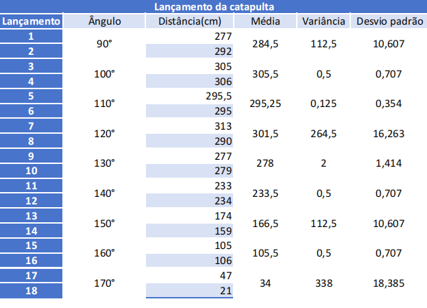

---
# Só mude aqui!!!!
author: "Luiz Gustavo dos Santos"
title: "Relatório 09"
bibliography: referencias.bib
# A partir daqui nao faca alteracoes!!!!!
link-citations: true
csl: associacao-brasileira-de-normas-tecnicas-ipea.csl
subtitle: "<a href='https://bendeivide.github.io/courses/epaec/' target='_blank'>Estatística e Probabilidade</a> </br> <a href='https://bendeivide.github.io' target='_blank'>Prof. Ben Dêivide (DEFIM/CAP/UFSJ)</a>"
include-before-body: header.html
date: now
date-format: "DD/MM/YYYY, HH:mm"
lang: pt-BR
format:
  html:
    toc: true
    number-sections: true
    theme: bootstrap
    #css: styles.css
    code-fold: true
    code-tools: true
execute:
  echo: true
  warning: false
  message: false
---


## 📌 Introdução

No estudo da física mecânica e da balística, o lançamento de projéteis é governado por leis cinemáticas que determinam a trajetória e o alcance de um objeto disparado no espaço. Em condições ideais, fatores como a velocidade inicial e o ângulo de disparo são as principais variáveis que ditam a distância horizontal percorrida. Contudo, em experimentos práticos utilizando dispositivos como catapultas, variáveis do ambiente — como a resistência do ar, o atrito mecânico do equipamento e imperfeições nos projéteis — introduzem variações e ruídos nos dados coletados, distanciando os resultados da teoria pura.

Para compreender o comportamento real do sistema e mitigar o impacto dessas incertezas experimentais, a aplicação de ferramentas estatísticas torna-se indispensável. Dentre essas técnicas, destaca-se a modelagem por regressão linear. Embora o alcance de um projétil apresente uma natureza curvilínea e parabólica em relação ao ângulo de disparo, a estatística permite expandir o conceito de regressão linear simples para o campo polinomial (regressão quadrática). Essa abordagem possibilita o ajuste de uma curva contínua otimizada que melhor representa o conjunto de dados discretos obtidos no laboratório.

Frente a isso, este relatório tem como objetivo principal aplicar o estudo da regressão linear polinomial sobre os dados coletados em um experimento de catapulta, visando modelar matematicamente a relação entre o ângulo de disparo e a distância alcançada pela bolinha. Por meio do ajuste desse modelo e da análise do seu comportamento geométrico (determinação do vértice da parábola), busca-se inferir de forma exata qual ângulo ideal proporciona a máxima distância de lançamento, validando a precisão do modelo estatístico frente às observações empíricas.


## 🎯 Objetivos

### Objetivo geral

Desejamos estudar a distância que a bolinha percorre arremessada pela catapulta em função do ângulo, níveis da variável B+.

### Objetivos específicos

 Estudo de regressão linear.Verificar se é possível informar qual o ângulo que leva a maior distância percorrida pela bolinha no experimento da catapulta.

---

## 📚  Fundamentação Teórica


Seguem os dados coletados no experimento:




### Ajuste linear


Para analisar esses dados usando regressão linear, foi preciso fazer uma pequena pausa conceitual: a relação entre o ângulo de disparo e a distância de um projétil que não é uma linha reta (linear), mas sim uma curva, uma parábola (regressão polinomial de 2º grau). Vamos ajustar um Modelo Linear Polinomial ($Y = \beta_0 + \beta_1 X + \beta_2 X^2$). Embora tenha uma curva, ele ainda é considerado um "modelo linear" na estatística porque os coeficientes são lineares.

Para chegar ao ângulo de máxima distância, nós transformamos o problema físico do lançamento em um problema matemático clássico.

**Passo 1: Comportamento dos Dados (A Parábola)**

Na física, o alcance horizontal de um projétil não cresce infinitamente com o ângulo. Ele sobe até certo ponto e depois começa a cair. Ao olharmos para os seus dados brutos, vemos exatamente isso:


* A 90°, a distância média é de cerca de 284,5 cm.


* A 100° e 120°, a distância sobe para a faixa dos 300 cm.


* A partir de 130°, a distância cai drasticamente, chegando a 34 cm em 170°.


Como os dados desenham uma curva em formato de "U" invertido, uma linha reta ($Y = \beta_0 + \beta_1 X$) seria incapaz de prever o topo. Por isso, usamos uma função quadrática (polinômio de segundo grau):


$$Y = \beta_0 + \beta_1 X + \beta_2 X^2$$


Onde:

* $Y$ é a Distância que queremos prever.

* $X$ é o Ângulo.

* $\beta_0, \beta_1, \beta_2$ são os coeficientes que se precisa encontrar.


**Passo 2: O Ajuste por Mínimos Quadrados**


Quando o R executa o comando lm(Distancia ~ Angulo + I(Angulo^2)), ele utiliza o método dos Mínimos Quadrados.

O software testa matematicamente infinitas curvas parabólicas possíveis contra os  18 pontos reais. A curva escolhida é aquela que minimiza a distância (o erro) entre os pontos reais coletados e a linha teórica da própria curva.

Ao convergir, o modelo encontrou os seguintes valores aproximados para os coeficientes (equação da catapulta):


$$\text{Distância} = -2421,7 + 51,57 \cdot (\text{Ângulo}) - 0,2402 \cdot (\text{Ângulo})^2$$
O coeficiente do $\text{Ângulo}^2$ é negativo ($-0,2402$). Na matemática, um termo quadrático negativo garante que a parábola tenha a concavidade voltada para baixo, ou seja, ela possui um ponto máximo.


**Passo 3: Cálculo do ponto Máximo**

O ponto máximo de uma curva ocorre exatamente onde a inclinação da reta tangente (a derivada) é igual a zero.


* Equação da distância:

$$f(x) = -0,2402x^2 + 51,57x - 2421,7$$


* Derivamos em relação a $x$ (ângulo):

$$f'(x) = 2 \cdot (-0,2402)x + 51,57$$

$$f'(x) = -0,4804x + 51,57$$

* Igualamos a derivada a zero para encontrar o ponto crítico:

$$-0,4804x + 51,57 = 0$$

$$51,57 = 0,4804x$$
$$x = \frac{51,57}{0,4804} \approx 107,35^\circ$$

A regressão linear múltipla/polinomial transformou os 18 lançamentos experimentais em uma lei matemática contínua. Usando as propriedades dessa curva (o vértice da parábola), descobrimos que, embora  tenhamos testado apenas os ângulos fechados de 100° e 110°, matematicamente o rendimento máximo da catapulta aconteceria se ela disparasse exatamente a 107,35°.


***Código no Rstudio?***

```{r}
# 1.  dados exatos
angulos     <- c(90, 90, 100, 100, 110, 110, 120, 120, 130, 130, 140, 140, 150, 150, 160, 160, 170, 170)
distancias  <- c(277, 292, 305, 306, 295.5, 295, 313, 290, 277, 279, 233, 234, 174, 159, 105, 106, 47, 21)

dados <- data.frame(Angulo = angulos, Distancia = distancias)

# 2. Ajustar o modelo de Regressão Polinomial (2º Grau)
# O I(Angulo^2) diz ao R para elevar o ângulo ao quadrado no modelo
modelo <- lm(Distancia ~ Angulo + I(Angulo^2), data = dados)

# Ver o resumo estatístico do modelo
summary(modelo)

# 3. Calcular matematicamente o ponto máximo (Vértice da Parábola)
# A fórmula do vértice é: Xv = -b / (2 * a)
b <- coef(modelo)[2] # Coeficiente do Angulo
a <- coef(modelo)[3] # Coeficiente do Angulo^2

angulo_maximo <- -b / (2 * a)
distancia_maxima_estimada <- predict(modelo, newdata = data.frame(Angulo = angulo_maximo))

# Exibir a resposta no console
cat("\n--- RESULTADO DA REGRESSÃO ---\n")
cat("O ângulo teórico para a maior distância é:", round(angulo_maximo, 2), "graus.\n")
cat("A distância máxima estimada para esse ângulo é:", round(distancia_maxima_estimada, 2), "cm.\n")

# 4. Plotar o gráfico com a curva de regressão
plot(dados$Angulo, dados$Distancia, 
     main = "Regressão Quadrática: Ângulo vs Distância",
     xlab = "Ângulo (Graus)", ylab = "Distância (cm)", 
     pch = 16, col = "blue", xlim = c(80, 180))

# Desenhar a linha do modelo
curve(coef(modelo)[1] + coef(modelo)[2]*x + coef(modelo)[3]*x^2, 
      add = TRUE, col = "red", lwd = 2)

# Marcar o ponto máximo no gráfico
points(angulo_maximo, distancia_maxima_estimada, col = "darkgreen", pch = 19, cex = 1.5)
text(angulo_maximo, distancia_maxima_estimada + 15, 
     labels = paste(round(angulo_maximo,1), "°"), col = "darkgreen", font = 2)
```


## ⚙️ Metodologia

::: {.callout-note}
Descreva como o experimento foi realizado.
:::

- Materiais utilizados  
- Procedimento  
- Número de repetições  

---

## 🔍 Resultados e Discussão

Apresente e interprete os resultados obtidos a partir dos dados coletados.

- Descreva os principais resultados numéricos (média, variabilidade, etc.).
- Comente o comportamento dos dados observados nos gráficos.
- Indique se há presença de valores discrepantes (outliers).
- Avalie se os dados apresentam simetria ou tendência.

Em seguida, discuta os resultados à luz dos conceitos teóricos:

- Os resultados estão de acordo com o esperado?
- Há grande variabilidade? O que isso significa no contexto do experimento?
- Quais fatores podem ter influenciado os resultados?
- Existem possíveis fontes de erro experimental?

Procure não apenas descrever, mas **interpretar os dados**.

### 💬 Exemplo de como citar uma referência bibliográfica

Depois de inserido as informaçõe no arquivo **referencias.bib**, use:

- Segundo @Rbasico2022
- Tudo é um objeto em R [@Rbasico2022]

### 📊  Análise de Dados

```{r}
distancia <- c(10.2, 9.8, 10.5, 10.1, 9.9, 10.3)
distancia
```

## 🧠 Considerações finais

Apresente uma síntese dos principais pontos observados no experimento.

- Retome o objetivo da prática e indique se ele foi alcançado.
- Destaque os principais aprendizados obtidos.
- Comente brevemente sobre a qualidade dos dados coletados.
- Sugira possíveis melhorias no procedimento experimental.

Evite repetir apenas os resultados; foque nas **conclusões e reflexões** sobre a prática realizada.

## Aprenda Quarto

Acesse [Quarto](https://quarto.org/).

## 📖 Referências