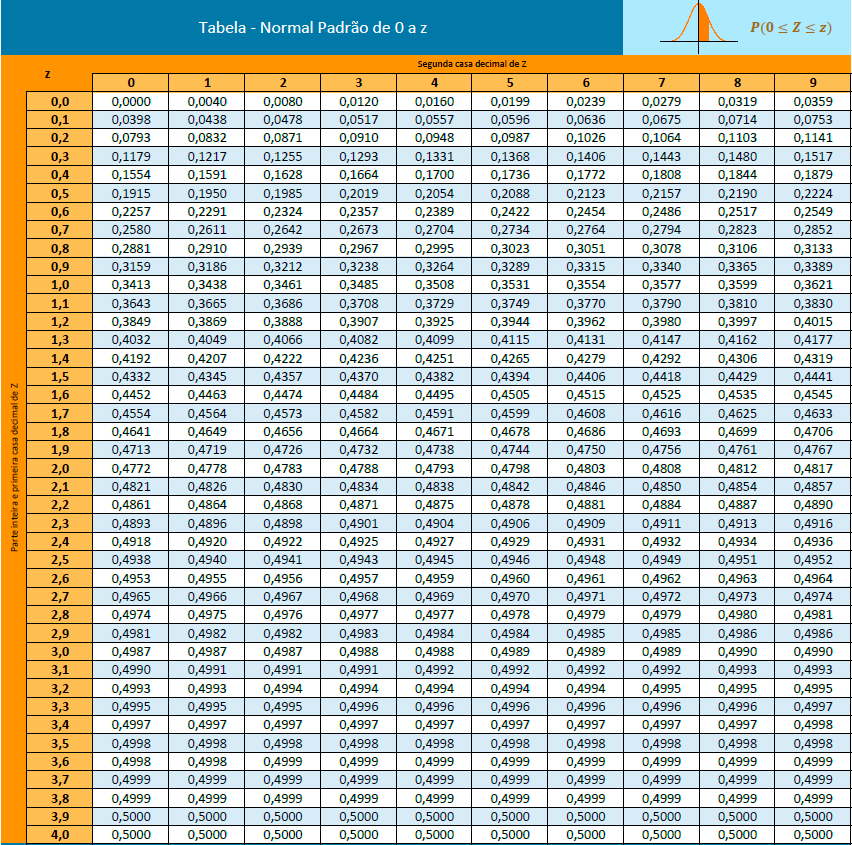

---
# Só mude aqui!!!!
author: "Luiz Gustavo dos Santos"
title: "Relatório 04"
bibliography: referencias.bib
# A partir daqui nao faca alteracoes!!!!!
link-citations: true
csl: associacao-brasileira-de-normas-tecnicas-ipea.csl
subtitle: "<a href='https://bendeivide.github.io/courses/epaec/' target='_blank'>Estatística e Probabilidade</a> </br> <a href='https://bendeivide.github.io' target='_blank'>Prof. Ben Dêivide (DEFIM/CAP/UFSJ)</a>"
include-before-body: header.html
date: today
lang: pt-BR
format:
  html:
    toc: true
    number-sections: true
    theme: bootstrap
    #css: styles.css
    code-fold: true
    code-tools: true
execute:
  echo: true
  warning: false
  message: false
---


## 📌 Introdução

As distribuições de probabilidade constituem um dos pilares fundamentais da estatística e da teoria das probabilidades, fornecendo a base matemática para a modelagem e análise de fenômenos aleatórios. Por meio delas, é possível descrever o comportamento de variáveis aleatórias, quantificar incertezas e extrair inferências confiáveis a partir de dados observados.


O estudo das distribuições de probabilidade apresenta relevância em diversas áreas do conhecimento, desde as ciências exatas e naturais até as ciências humanas e sociais. Na engenharia, na medicina, na economia e nas ciências computacionais, a modelagem probabilística permite compreender padrões, prever comportamentos e embasar decisões em contextos de incerteza.


## 🎯 Objetivos

### Objetivo geral

Este relatório tem como objetivo apresentar os principais tipos de distribuições de probabilidade, discutindo suas características, propriedades e aplicações práticas. Serão abordadas tanto as **distribuições discretas** como a binomial e a de Poisson, quanto as **distribuições contínuas** com destaque para a distribuição normal, além dos conceitos fundamentais que as sustentam, como a função de densidade de probabilidade e a função de distribuição acumulada.


### Objetivos específicos

Demonstrar 3 tipos de distribuições de probabilidade, seu cálculo e suas aplicações no dia-a-dia da engenharia.

---

## Distribuições de probabilidade 

As distribuições de probabilidade descrevem como os valores de uma variável aleatória se distribuem, ou seja, qual a chance de cada resultado ocorrer.
Existem dois grandes tipos. As **distribuições discretas** lidam com variáveis que assumem valores contáveis — como o número de caras em lançamentos de moeda. As **distribuições contínuas** descrevem variáveis que podem assumir qualquer valor em um intervalo, como altura ou temperatura.


### Tipos de distribuição de probabilidades


#### Distribuição normal ou Gaussiana

Distribuição Normal (Gaussiana) — a famosa **"curva em sino"**. Simétrica em torno da média, descreve fenômenos naturais como altura, peso e erros de medição. É central na estatística por causa do Teorema do Limite Central.


Como calcular?

**A) A distribuição normal é definida pela sua função de densidade de probabilidade (PDF):**

$$f(x) = \frac{1}{\sigma\sqrt{2\pi}} e^{-\frac{1}{2}\left(\frac{x-\mu}{\sigma}\right)^2}$$

onde μ\mu    é a média e σ\sigma
é o desvio padrão.

**B) Probabilidade como área sob a curva:**


A probabilidade de X deve estar em um intervalo
[a,b] é a integral da PDF:

$$P(a \leq X \leq b) = \int_{a}^{b} \frac{1}{\sigma\sqrt{2\pi}} e^{-\frac{1}{2}\left(\frac{x-\mu}{\sigma}\right)^2} dx$$
O problema analítico central é que essa integral não tem solução em forma fechada — não existe uma antiderivada elementar para $e^{-x^2}$. Por isso, na prática, ela é resolvida por dois caminhos.


**Caminho 1: Padronização (variável Z):**
Qualquer distribuição normal $X \sim \mathcal{N}(\mu, \sigma^2)$ pode ser transformada na distribuição normal padrão $X \sim \mathcal{N}(0,1)$ pela substituição: $$Z = \frac{X - \mu}{\sigma}$$


A Função densidade de probabilidade **(PDF)** simplifica para:
$$\phi(z) = \frac{1}{\sqrt{2\pi}} e^{-z^2 / 2}$$
E a função de distribuição acumulada **(FDA)** torna-se:
$$  \Phi(z) = \int_{-\infty}^{z} \phi(t) \, dt$$

**Caminho 2: A função Erro(ERF):**

A única forma de expressar $Φ(z)$ analiticamente é por meio da função erro, definida como:

$$\text{erf}(x) = \frac{2}{\sqrt{\pi}} \int_{0}^{x} e^{-t^2} \, dt$$


A relação com a **FDA** normal é:


$$\Phi(z) = \frac{1}{2} \left[ 1 + \text{erf}\left( \frac{z}{\sqrt{2}} \right) \right]$$

**Na prática**


Para calcular $P(a≤X≤b)$ analiticamente, usa-se:

$$P(a \leq X \leq b) = \Phi \left( \frac{b - \mu}{\sigma} \right) - \Phi \left( \frac{a - \mu}{\sigma} \right)$$

Antes dos computadores, os valores de $Φ(z)$ eram consultados em tabelas Z pré-calculadas numericamente.Hoje são calculados diretamente por algoritmos.Veja a seguir uma imagem da tabela da normal padrão com os valores da **função de distribuição acumulada $Φ(z)$**:  




Em resumo: **a distribuição normal** é definida de forma exata e fechada pela sua **Função densidade de probabilidade(PDF)**, mas o cálculo de probabilidades exige integração numérica ou a função erro — não existe uma fórmula simples de antiderivada. Isso a torna analiticamente elegante, mas computacionalmente dependente de aproximações.

##### **Exemplo de aplicação**

 Suponha que a altura de adultos siga $X∼N(μ=170,σ=10)$.Pede-se a probabilidade dos adultos terem a altura entre 1,60m e 1,85m. Queremos calcular:
  $$P(160≤X≤185)$$
  **Passo 1 — Padronizar os limites:**
  
  
  $z_1 = \frac{160 - 170}{10} = -1,0$ $z_2 = \frac{185 - 170}{10} = 1,5$

 **Passo 2 — Consultar os valores da FDA($Φ(z)$) na tabela: **
 
 
 Os valores da função de distribuição acumulada ($Φ(z)$) ou probabilidade de "z" estão apresentados na tabela de probabilidades da frequência normal.
 
 
 $Φ(−1,0)=0,1587$
 $Φ(1,5)=0,9332$

 
 **Passo 3 — Subtrair as probabilidades $Φ(z2)$ - $Φ(z1)$  :**
 
$$ P(160≤X≤185)=0,9332−0,1587=0,7745$$
 Ou seja, aproximadamente 77,5% das pessoas têm entre 160 cm e 185 cm.
 
 
**COMO FAZER UTILIZANDO O RSTUDIO??**


#### Distribuição Binomial

Distribuição Binomial — modela o número de sucessos em nn
n tentativas independentes, cada uma com probabilidade pp
p de sucesso. Exemplo clássico: quantas caras saem em 10 lançamentos de moeda.

**Colocar o exemplo,tanto analítico quanto em r**

#### Distribuição de Poisson

Distribuição de Poisson — conta eventos raros em um intervalo de tempo ou espaço fixo. Útil para modelar chegadas de clientes, falhas de equipamento, etc.


**Colocar o exemplo,tanto analítico quanto em r**


```{r}

```

---

## ⚙️ Metodologia

::: {.callout-note}
Descreva como o experimento foi realizado.
:::

- Materiais utilizados  
- Procedimento  
- Número de repetições  

---

## 🔍 Resultados e Discussão

Apresente e interprete os resultados obtidos a partir dos dados coletados.

- Descreva os principais resultados numéricos (média, variabilidade, etc.).
- Comente o comportamento dos dados observados nos gráficos.
- Indique se há presença de valores discrepantes (outliers).
- Avalie se os dados apresentam simetria ou tendência.

Em seguida, discuta os resultados à luz dos conceitos teóricos:

- Os resultados estão de acordo com o esperado?
- Há grande variabilidade? O que isso significa no contexto do experimento?
- Quais fatores podem ter influenciado os resultados?
- Existem possíveis fontes de erro experimental?

Procure não apenas descrever, mas **interpretar os dados**.

### 💬 Exemplo de como citar uma referência bibliográfica

Depois de inserido as informaçõe no arquivo **referencias.bib**, use:

- Segundo @Rbasico2022
- Tudo é um objeto em R [@Rbasico2022]

### 📊  Análise de Dados

```{r}
distancia <- c(10.2, 9.8, 10.5, 10.1, 9.9, 10.3)
distancia
```

## 🧠 Considerações finais

Apresente uma síntese dos principais pontos observados no experimento.

- Retome o objetivo da prática e indique se ele foi alcançado.
- Destaque os principais aprendizados obtidos.
- Comente brevemente sobre a qualidade dos dados coletados.
- Sugira possíveis melhorias no procedimento experimental.

Evite repetir apenas os resultados; foque nas **conclusões e reflexões** sobre a prática realizada.

## Aprenda Quarto

Acesse [Quarto](https://quarto.org/).

## 📖 Referências